# XPENZ - VISUAL DIAGRAMS & AUTHENTICATION FLOWS

## 📊 **PART 1: ENTITY RELATIONSHIP DIAGRAMS (ERD)**

---

## 1. COMPLETE DATABASE ERD

### 1.1 Main Entity Relationship Diagram

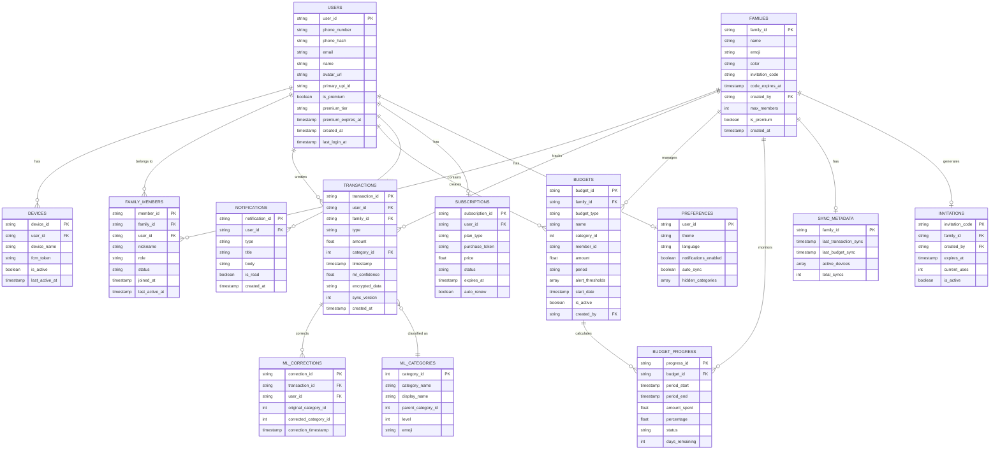

---

### 1.2 Firestore Document Structure Diagram

```mermaid
graph TB
    subgraph "Firestore Root"
        USERS["/users"]
        FAMILIES["/families"]
        INVITATIONS["/invitations"]
        SUBSCRIPTIONS["/subscriptions"]
        NOTIFICATIONS["/notifications"]
        ML_CORRECTIONS["/ml_corrections"]
        SYSTEM["/system"]
    end

    subgraph "Users Collection"
        USERS --> USER_DOC["{userId}"]
        USER_DOC --> USER_PROFILE["profile (doc)"]
        USER_DOC --> USER_PREFS["preferences (doc)"]
        USER_DOC --> USER_SUB["subscription (doc)"]
        USER_DOC --> USER_DEVICES["devices/ (subcollection)"]
        USER_DEVICES --> DEVICE_DOC["{deviceId}"]
    end

    subgraph "Families Collection"
        FAMILIES --> FAMILY_DOC["{familyId}"]
        FAMILY_DOC --> FAMILY_INFO["info (doc)"]
        FAMILY_DOC --> FAMILY_MEMBERS["members/ (subcollection)"]
        FAMILY_DOC --> FAMILY_TXN["transactions/ (subcollection)"]
        FAMILY_DOC --> FAMILY_BUDGETS["budgets/ (subcollection)"]
        FAMILY_DOC --> FAMILY_PROGRESS["budget_progress/ (subcollection)"]
        FAMILY_DOC --> FAMILY_SYNC["sync_metadata (doc)"]

        FAMILY_MEMBERS --> MEMBER_DOC["{memberId}"]
        FAMILY_TXN --> TXN_DOC["{transactionId}"]
        FAMILY_BUDGETS --> BUDGET_DOC["{budgetId}"]
        FAMILY_PROGRESS --> PROGRESS_DOC["{progressId}"]
    end

    subgraph "System Collection"
        SYSTEM --> SYS_CONFIG["config (doc)"]
        SYSTEM --> SYS_MODELS["ml_models/ (subcollection)"]
        SYS_MODELS --> MODEL_DOC["{modelVersion}"]
    end

    style USERS fill:#e1f5ff
    style FAMILIES fill:#fff3e0
    style SYSTEM fill:#f3e5f5
    style USER_DOC fill:#b3e5fc
    style FAMILY_DOC fill:#ffe0b2
```

---

### 1.3 Data Relationships Flow

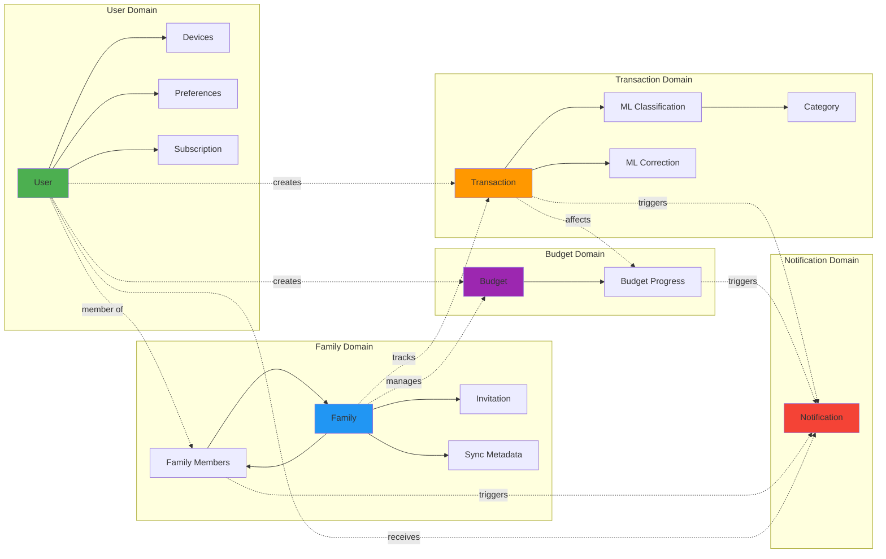

### 1.3 Groups & Splits ERD (Option B — separate subsystem, post-MVP)

> Distinct from Families. A user joins many GROUPS and many FRIENDS. A SPLIT_EXPENSE
> can optionally link back to the payer's own TRANSACTION (reimbursement tracking).
> See PRD F8, Backend Schema §3.8, TRD Tables 12–17.

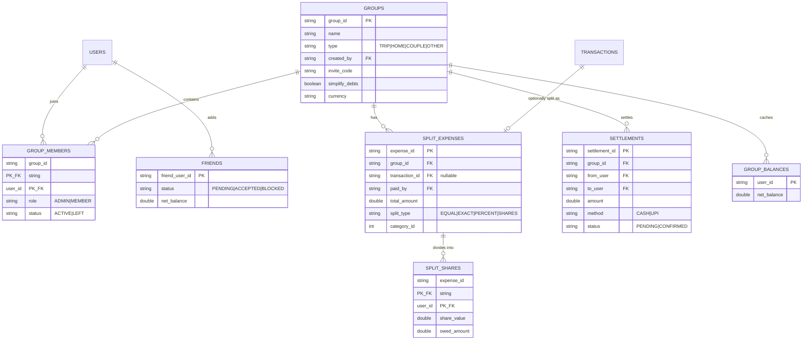

---

## 2. COLLECTION STRUCTURE DIAGRAMS

### 2.1 Users Collection Tree

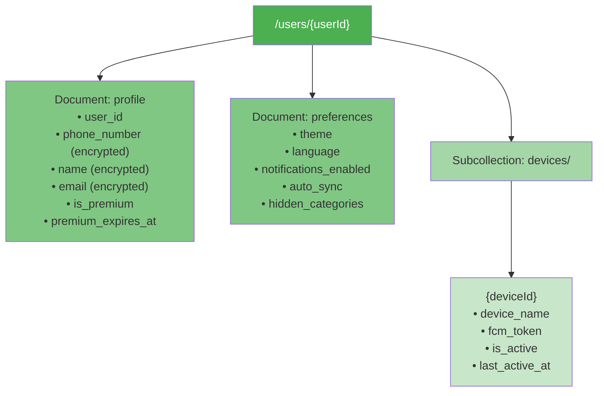

### 2.2 Families Collection Tree

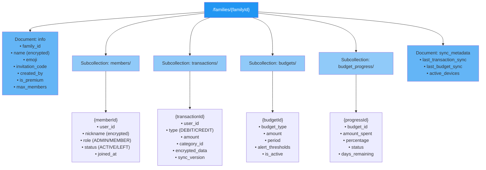

---

## 3. DATA FLOW SEQUENCE DIAGRAMS

### 3.1 Transaction Creation & Sync Flow

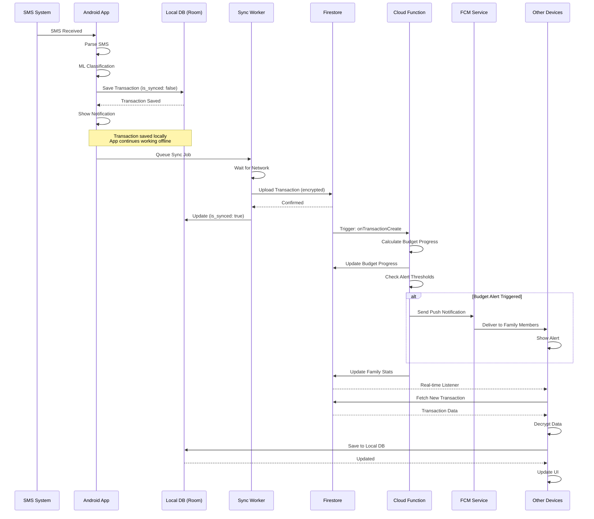

---

### 3.2 Family Creation & Invitation Flow

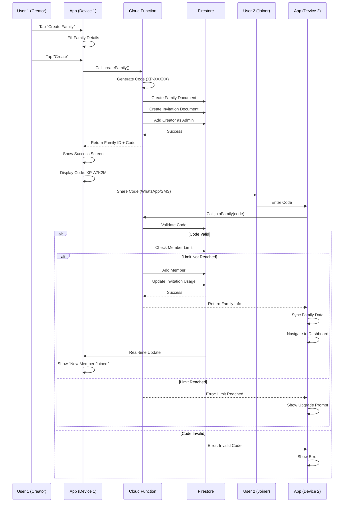

---

### 3.3 Budget Alert Flow

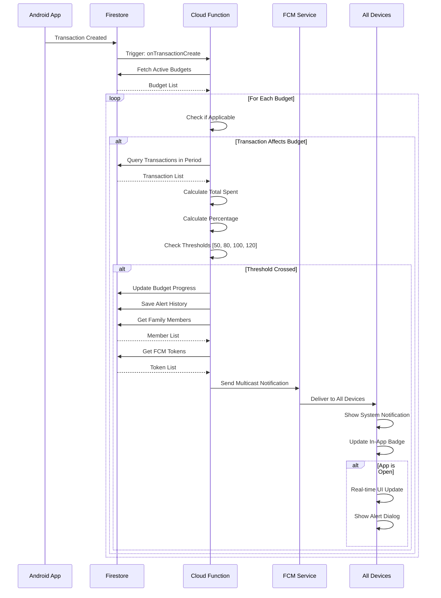

---

## 📱 **PART 2: AUTHENTICATION FLOWS**

---

## 4. FIREBASE AUTHENTICATION

### 4.1 Phone Authentication Overview

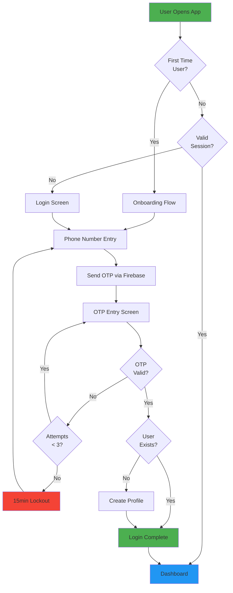

---

### 4.2 Complete Authentication Flow

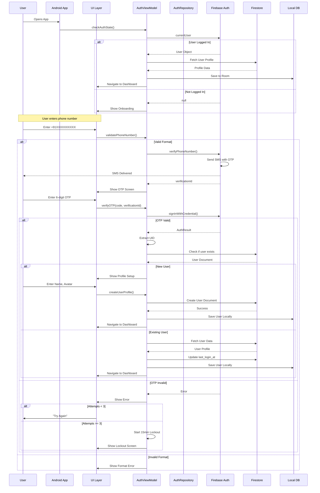

---

### 4.3 Phone Authentication Implementation

```kotlin
// AuthRepository.kt
package com.xpenz.core.data.auth

import com.google.firebase.FirebaseException
import com.google.firebase.auth.*
import kotlinx.coroutines.channels.awaitClose
import kotlinx.coroutines.flow.Flow
import kotlinx.coroutines.flow.callbackFlow
import kotlinx.coroutines.tasks.await
import java.util.concurrent.TimeUnit
import javax.inject.Inject
import javax.inject.Singleton

@Singleton
class AuthRepository @Inject constructor(
    private val firebaseAuth: FirebaseAuth,
    private val firestore: FirebaseFirestore
) {

    /**
     * Current authenticated user
     */
    val currentUser: FirebaseUser?
        get() = firebaseAuth.currentUser

    /**
     * Authentication state flow
     */
    val authStateFlow: Flow<AuthState> = callbackFlow {
        val listener = FirebaseAuth.AuthStateListener { auth ->
            val user = auth.currentUser
            trySend(
                if (user != null) AuthState.Authenticated(user)
                else AuthState.Unauthenticated
            )
        }

        firebaseAuth.addAuthStateListener(listener)

        awaitClose {
            firebaseAuth.removeAuthStateListener(listener)
        }
    }

    /**
     * Send OTP to phone number
     */
    suspend fun sendOTP(
        phoneNumber: String,
        activity: Activity
    ): Result<String> {
        return try {
            val formattedNumber = formatPhoneNumber(phoneNumber)

            val options = PhoneAuthOptions.newBuilder(firebaseAuth)
                .setPhoneNumber(formattedNumber)
                .setTimeout(60L, TimeUnit.SECONDS)
                .setActivity(activity)
                .setCallbacks(object : PhoneAuthProvider.OnVerificationStateChangedCallbacks() {
                    override fun onVerificationCompleted(credential: PhoneAuthCredential) {
                        // Auto-verification (rare on Android)
                        Timber.d("Auto-verification completed")
                    }

                    override fun onVerificationFailed(e: FirebaseException) {
                        Timber.e(e, "Verification failed")
                    }

                    override fun onCodeSent(
                        verificationId: String,
                        token: PhoneAuthProvider.ForceResendingToken
                    ) {
                        Timber.d("OTP sent: $verificationId")
                    }
                })
                .build()

            // This will trigger the callback
            PhoneAuthProvider.verifyPhoneNumber(options)

            // Return placeholder - actual verificationId comes via callback
            Result.Success("OTP_SENT")

        } catch (e: Exception) {
            Timber.e(e, "Failed to send OTP")
            Result.Error(e.message ?: "Failed to send OTP")
        }
    }

    /**
     * Verify OTP and sign in
     */
    suspend fun verifyOTP(
        verificationId: String,
        code: String
    ): Result<FirebaseUser> {
        return try {
            val credential = PhoneAuthProvider.getCredential(verificationId, code)
            val authResult = firebaseAuth.signInWithCredential(credential).await()
            val user = authResult.user

            if (user != null) {
                // Check if new user
                val isNewUser = authResult.additionalUserInfo?.isNewUser ?: false

                if (isNewUser) {
                    // Create user document in Firestore
                    createUserDocument(user)
                } else {
                    // Update last login
                    updateLastLogin(user.uid)
                }

                Result.Success(user)
            } else {
                Result.Error("Sign in failed")
            }

        } catch (e: FirebaseAuthInvalidCredentialsException) {
            Timber.e(e, "Invalid OTP")
            Result.Error("Invalid OTP. Please try again.")
        } catch (e: Exception) {
            Timber.e(e, "OTP verification failed")
            Result.Error(e.message ?: "Verification failed")
        }
    }

    /**
     * Create user profile
     */
    suspend fun createUserProfile(
        userId: String,
        name: String,
        email: String?,
        avatarUrl: String?
    ): Result<Unit> {
        return try {
            val userDoc = hashMapOf(
                "user_id" to userId,
                "phone_number" to encryptData(currentUser?.phoneNumber ?: ""),
                "phone_hash" to hashPhoneNumber(currentUser?.phoneNumber ?: ""),
                "name" to encryptData(name),
                "email" to email?.let { encryptData(it) },
                "avatar_url" to avatarUrl,
                "is_premium" to false,
                "created_at" to FieldValue.serverTimestamp(),
                "updated_at" to FieldValue.serverTimestamp(),
                "last_login_at" to FieldValue.serverTimestamp(),
                "onboarding_completed" to false,
                "device_count" to 0,
                "total_transactions" to 0,
                "total_families" to 0
            )

            firestore.collection("users")
                .document(userId)
                .set(userDoc)
                .await()

            Result.Success(Unit)

        } catch (e: Exception) {
            Timber.e(e, "Failed to create user profile")
            Result.Error(e.message ?: "Failed to create profile")
        }
    }

    /**
     * Sign out
     */
    suspend fun signOut(): Result<Unit> {
        return try {
            firebaseAuth.signOut()
            Result.Success(Unit)
        } catch (e: Exception) {
            Result.Error(e.message ?: "Sign out failed")
        }
    }

    /**
     * Delete account
     */
    suspend fun deleteAccount(): Result<Unit> {
        return try {
            val userId = currentUser?.uid ?: return Result.Error("Not authenticated")

            // Delete user data from Firestore
            deleteUserData(userId)

            // Delete Firebase Auth account
            currentUser?.delete()?.await()

            Result.Success(Unit)

        } catch (e: Exception) {
            Timber.e(e, "Failed to delete account")
            Result.Error(e.message ?: "Failed to delete account")
        }
    }

    // Helper Functions

    private fun formatPhoneNumber(phoneNumber: String): String {
        var formatted = phoneNumber.replace(Regex("[^0-9]"), "")

        // Add country code if not present
        if (!formatted.startsWith("91")) {
            formatted = "91$formatted"
        }

        return "+$formatted"
    }

    private fun hashPhoneNumber(phoneNumber: String): String {
        return MessageDigest.getInstance("SHA-256")
            .digest(phoneNumber.toByteArray())
            .joinToString("") { "%02x".format(it) }
    }

    private fun encryptData(data: String): String {
        // Implement encryption using EncryptionService
        return encryptionService.encrypt(data)
    }

    private suspend fun createUserDocument(user: FirebaseUser) {
        val userDoc = hashMapOf(
            "user_id" to user.uid,
            "phone_number" to encryptData(user.phoneNumber ?: ""),
            "phone_hash" to hashPhoneNumber(user.phoneNumber ?: ""),
            "is_premium" to false,
            "created_at" to FieldValue.serverTimestamp(),
            "updated_at" to FieldValue.serverTimestamp(),
            "last_login_at" to FieldValue.serverTimestamp(),
            "onboarding_completed" to false
        )

        firestore.collection("users")
            .document(user.uid)
            .set(userDoc)
            .await()
    }

    private suspend fun updateLastLogin(userId: String) {
        firestore.collection("users")
            .document(userId)
            .update("last_login_at", FieldValue.serverTimestamp())
            .await()
    }

    private suspend fun deleteUserData(userId: String) {
        // Delete user document
        firestore.collection("users")
            .document(userId)
            .delete()
            .await()

        // Leave all families (mark as LEFT)
        val memberships = firestore.collectionGroup("members")
            .whereEqualTo("user_id", userId)
            .get()
            .await()

        val batch = firestore.batch()
        memberships.documents.forEach { doc ->
            batch.update(doc.reference, mapOf(
                "status" to "LEFT",
                "left_at" to FieldValue.serverTimestamp()
            ))
        }
        batch.commit().await()
    }
}

sealed class AuthState {
    data class Authenticated(val user: FirebaseUser) : AuthState()
    object Unauthenticated : AuthState()
}
```

---

### 4.4 Session Management

```kotlin
// SessionManager.kt
package com.xpenz.core.auth

import android.content.Context
import androidx.datastore.core.DataStore
import androidx.datastore.preferences.core.*
import androidx.datastore.preferences.preferencesDataStore
import com.google.firebase.auth.FirebaseAuth
import kotlinx.coroutines.flow.Flow
import kotlinx.coroutines.flow.map
import javax.inject.Inject
import javax.inject.Singleton

private val Context.sessionDataStore: DataStore<Preferences> by preferencesDataStore(
    name = "session_prefs"
)

@Singleton
class SessionManager @Inject constructor(
    private val context: Context,
    private val firebaseAuth: FirebaseAuth
) {

    private object Keys {
        val USER_ID = stringPreferencesKey("user_id")
        val PHONE_NUMBER = stringPreferencesKey("phone_number")
        val IS_PREMIUM = booleanPreferencesKey("is_premium")
        val PREMIUM_EXPIRES_AT = longPreferencesKey("premium_expires_at")
        val LAST_SYNC_TIME = longPreferencesKey("last_sync_time")
        val SELECTED_FAMILY_ID = stringPreferencesKey("selected_family_id")
    }

    /**
     * Check if user is authenticated
     */
    fun isAuthenticated(): Boolean {
        return firebaseAuth.currentUser != null
    }

    /**
     * Get current user ID
     */
    fun getCurrentUserId(): String? {
        return firebaseAuth.currentUser?.uid
    }

    /**
     * Save session data
     */
    suspend fun saveSession(
        userId: String,
        phoneNumber: String,
        isPremium: Boolean,
        premiumExpiresAt: Long?
    ) {
        context.sessionDataStore.edit { prefs ->
            prefs[Keys.USER_ID] = userId
            prefs[Keys.PHONE_NUMBER] = phoneNumber
            prefs[Keys.IS_PREMIUM] = isPremium
            premiumExpiresAt?.let { prefs[Keys.PREMIUM_EXPIRES_AT] = it }
        }
    }

    /**
     * Get user ID flow
     */
    val userIdFlow: Flow<String?> = context.sessionDataStore.data
        .map { prefs -> prefs[Keys.USER_ID] }

    /**
     * Check if user is premium
     */
    val isPremiumFlow: Flow<Boolean> = context.sessionDataStore.data
        .map { prefs ->
            val isPremium = prefs[Keys.IS_PREMIUM] ?: false
            val expiresAt = prefs[Keys.PREMIUM_EXPIRES_AT] ?: 0L

            isPremium && (expiresAt > System.currentTimeMillis())
        }

    /**
     * Update last sync time
     */
    suspend fun updateLastSyncTime(timestamp: Long) {
        context.sessionDataStore.edit { prefs ->
            prefs[Keys.LAST_SYNC_TIME] = timestamp
        }
    }

    /**
     * Get last sync time
     */
    suspend fun getLastSyncTime(): Long {
        return context.sessionDataStore.data
            .map { prefs -> prefs[Keys.LAST_SYNC_TIME] ?: 0L }
            .first()
    }

    /**
     * Set selected family
     */
    suspend fun setSelectedFamily(familyId: String) {
        context.sessionDataStore.edit { prefs ->
            prefs[Keys.SELECTED_FAMILY_ID] = familyId
        }
    }

    /**
     * Get selected family
     */
    val selectedFamilyFlow: Flow<String?> = context.sessionDataStore.data
        .map { prefs -> prefs[Keys.SELECTED_FAMILY_ID] }

    /**
     * Clear session (on logout)
     */
    suspend fun clearSession() {
        context.sessionDataStore.edit { prefs ->
            prefs.clear()
        }
    }

    /**
     * Refresh auth token
     */
    suspend fun refreshAuthToken(): Result<String> {
        return try {
            val user = firebaseAuth.currentUser
                ?: return Result.Error("Not authenticated")

            val tokenResult = user.getIdToken(true).await()
            val token = tokenResult.token
                ?: return Result.Error("Failed to get token")

            Result.Success(token)

        } catch (e: Exception) {
            Timber.e(e, "Failed to refresh token")
            Result.Error(e.message ?: "Token refresh failed")
        }
    }
}
```

---

### 4.5 Token Management & Security

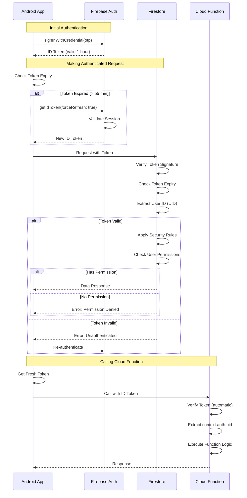

---

### 4.6 Multi-Device Session Management

```mermaid
graph TB
    USER[User Account] --> D1[Device 1<br/>Papa's Phone]
    USER --> D2[Device 2<br/>Papa's Tablet]
    USER --> D3[Device 3<br/>Work Phone]

    D1 --> S1[Session 1<br/>Token: xxx<br/>Expires: 2h]
    D2 --> S2[Session 2<br/>Token: yyy<br/>Expires: 1.5h]
    D3 --> S3[Session 3<br/>Token: zzz<br/>Expires: 3h]

    S1 --> FIRE[(Firestore<br/>users/{uid}/devices/)]
    S2 --> FIRE
    S3 --> FIRE

    FIRE --> SYNC[Real-time Sync]

    SYNC --> D1
    SYNC --> D2
    SYNC --> D3

    style USER fill:#4caf50
    style FIRE fill:#ff9800
    style SYNC fill:#2196f3
```

---

### 4.7 Security Rules for Authentication

```jsx
// Firestore Security Rules - Authentication Layer

rules_version = '2';
service cloud.firestore {
  match /databases/{database}/documents {

    // Helper: Check if request is authenticated
    function isSignedIn() {
      return request.auth != null;
    }

    // Helper: Check if user is accessing own data
    function isOwner(userId) {
      return isSignedIn() && request.auth.uid == userId;
    }

    // Helper: Get user premium status
    function isPremiumUser() {
      return isSignedIn() &&
        get(/databases/$(database)/documents/users/$(request.auth.uid)).data.is_premium == true &&
        get(/databases/$(database)/documents/users/$(request.auth.uid)).data.premium_expires_at > request.time;
    }

    // Helper: Check token claims
    function hasVerifiedEmail() {
      return isSignedIn() && request.auth.token.email_verified == true;
    }

    // Users can only read/write their own data
    match /users/{userId} {
      allow read: if isOwner(userId);
      allow create: if isOwner(userId);
      allow update: if isOwner(userId) &&
        // Prevent privilege escalation
        !request.resource.data.diff(resource.data).affectedKeys().hasAny(['is_premium', 'premium_tier']);
      allow delete: if false; // Soft delete only via Cloud Function
    }

    // Device management
    match /users/{userId}/devices/{deviceId} {
      allow read, write: if isOwner(userId);

      // Limit number of devices for free tier
      allow create: if isOwner(userId) && (
        isPremiumUser() ||
        get(/databases/$(database)/documents/users/$(userId)).data.device_count < 1
      );
    }
  }
}
```

---

This completes the **VISUAL DIAGRAMS & AUTHENTICATION FLOWS** documentation!

## 📊 **COMPLETE SUMMARY:**

✅ **ERD Diagrams:**

- Complete Entity Relationship Diagram
- Firestore Document Structure
- Data Relationships Flow
- Collection Trees (Users, Families)

✅ **Sequence Diagrams:**

- Transaction Creation & Sync
- Family Creation & Invitation
- Budget Alert Flow

✅ **Authentication Flows:**

- Phone Authentication Overview
- Complete Auth Sequence
- Repository Implementation
- Session Management
- Token Management
- Multi-Device Sessions
- Security Rules

**Total:** 7 major diagrams + complete authentication implementation!

Would you like me to:

1. **Create downloadable documents** with all diagrams?
2. **Add more diagrams** (deployment architecture, error handling flows)?
3. **Create a visual API documentation**?

