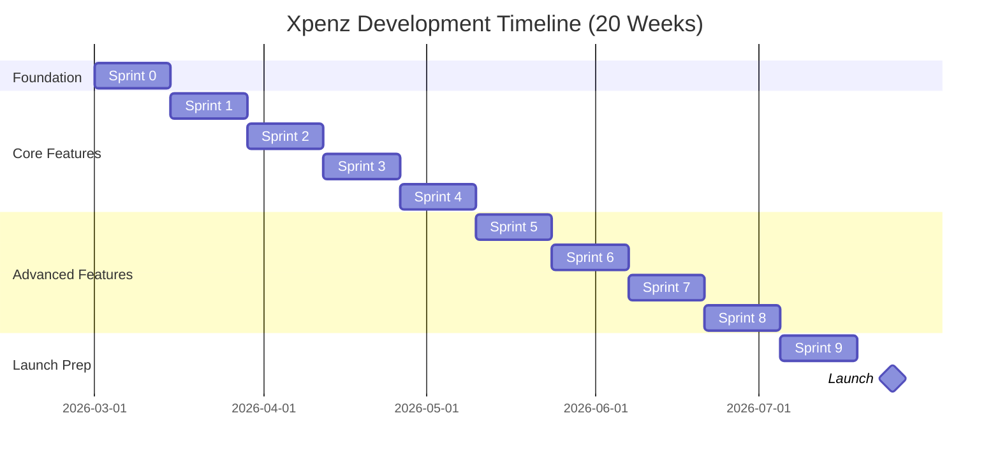
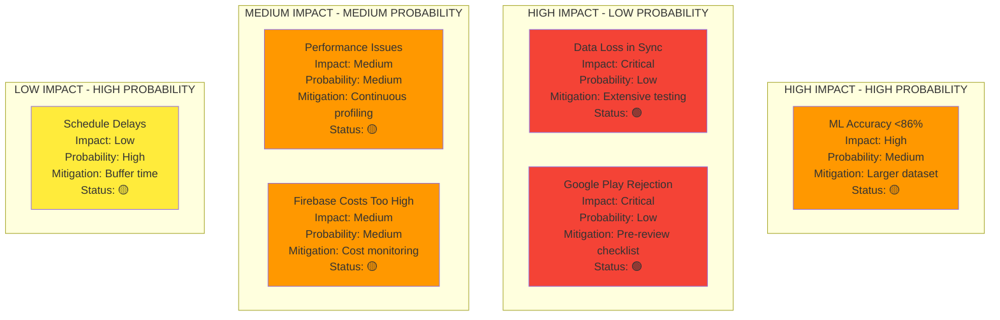
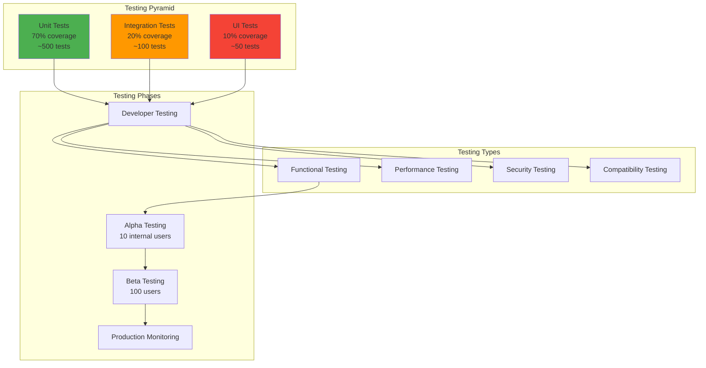
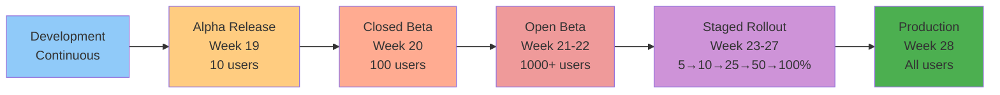

# XPENZ - COMPLETE IMPLEMENTATION PLAN

## 📋 **20-WEEK DEVELOPMENT ROADMAP**

---

## TABLE OF CONTENTS

1. [Project Overview](https://claude.ai/chat/971e7306-581e-44ad-b38d-cd0919b5edd6#1-project-overview)
2. [Team Structure](https://claude.ai/chat/971e7306-581e-44ad-b38d-cd0919b5edd6#2-team-structure)
3. [Sprint Breakdown (10 Sprints × 2 Weeks)](https://claude.ai/chat/971e7306-581e-44ad-b38d-cd0919b5edd6#3-sprint-breakdown)
4. [Detailed Sprint Plans](https://claude.ai/chat/971e7306-581e-44ad-b38d-cd0919b5edd6#4-detailed-sprint-plans)
5. [Risk Management](https://claude.ai/chat/971e7306-581e-44ad-b38d-cd0919b5edd6#5-risk-management)
6. [Quality Assurance Plan](https://claude.ai/chat/971e7306-581e-44ad-b38d-cd0919b5edd6#6-quality-assurance-plan)
7. [Deployment Strategy](https://claude.ai/chat/971e7306-581e-44ad-b38d-cd0919b5edd6#7-deployment-strategy)
8. [Success Metrics](https://claude.ai/chat/971e7306-581e-44ad-b38d-cd0919b5edd6#8-success-metrics)
9. [Contingency Plans](https://claude.ai/chat/971e7306-581e-44ad-b38d-cd0919b5edd6#9-contingency-plans)
10. [Post-Launch Roadmap](https://claude.ai/chat/971e7306-581e-44ad-b38d-cd0919b5edd6#10-post-launch-roadmap)

---

## 1. PROJECT OVERVIEW

### 1.1 Project Summary

```yaml
Project Name: Xpenz - Smart Family Expense Tracker
Duration: 20 Weeks (5 Months)
Start Date: March 1, 2026
Target Launch: July 25, 2026
Team Size: 1 Developer (AI-Assisted)
Methodology: Agile/Scrum
Sprint Length: 2 weeks
Total Sprints: 10
```

### 1.2 Success Criteria

```
✅ MVP Launch:
   - All core features functional
   - 90%+ transaction detection accuracy
   - <2% crash rate
   - 4.0+ star rating target

✅ Technical Goals:
   - <200ms ML inference (p95)
   - <5s sync time across devices
   - 60 FPS UI performance
   - 86-90% ML accuracy (top-1)

✅ Business Goals:
   - 1,000 beta users by launch
   - 5% premium conversion rate
   - 70%+ 7-day retention
   - 50%+ 30-day retention
```

---

## 2. TEAM STRUCTURE

### 2.1 Core Team

```
👨‍💻 SOLO DEVELOPER (You)
├── Frontend Development (Android/Compose)
├── Backend Development (Firebase/Cloud Functions)
├── ML Model Integration
├── Testing & QA
└── DevOps & Deployment

🤖 AI ASSISTANTS (Claude/GitHub Copilot)
├── Code Generation
├── Bug Fixing
├── Documentation
├── Testing Scripts
└── Code Review

📚 EXTERNAL RESOURCES
├── Firebase Support
├── Google Play Console
├── Beta Testers (Family & Friends)
└── Design Resources (Material Design)
```

### 2.2 Time Allocation

```
Per Week (40 hours):
├── Development: 32 hours (80%)
├── Testing: 4 hours (10%)
├── Documentation: 2 hours (5%)
├── Planning/Meetings: 2 hours (5%)

Per Sprint (80 hours):
├── Development: 64 hours
├── Testing: 8 hours
├── Documentation: 4 hours
├── Sprint Planning/Retro: 4 hours
```

---

## 3. SPRINT BREAKDOWN

### 3.1 High-Level Timeline



### 3.2 Feature Completion Matrix

| Sprint | Core Features | Status | Dependencies |
| --- | --- | --- | --- |
| **0** | Project Setup, Architecture, DB | 🔵 Foundation | None |
| **1** | SMS Detection, Parsing | 🟢 Core | Sprint 0 |
| **2** | ML Models, Inference | 🟢 Core | Sprint 0, 1 |
| **3** | Transaction CRUD, UI | 🟢 Core | Sprint 1, 2 |
| **4** | Auth, Onboarding | 🟢 Core | Sprint 0 |
| **5** | Family Management | 🟡 Advanced | Sprint 3, 4 |
| **6** | Budget System | 🟡 Advanced | Sprint 3, 5 |
| **7** | Cloud Sync | 🟠 Premium | Sprint 5, 6 |
| **8** | Subscription, Billing | 🟠 Premium | Sprint 7 |
| **9** | Polish, Optimization, Testing | 🔴 Critical | All |

**Legend:**

- 🔵 Foundation - Must complete perfectly
- 🟢 Core - Essential for MVP
- 🟡 Advanced - Important for differentiation
- 🟠 Premium - Monetization features
- 🔴 Critical - Launch readiness

---

## 4. DETAILED SPRINT PLANS

### SPRINT 0: Foundation & Setup (Week 1-2)

### **Goals:**

✅ Project infrastructure ready

✅ Development environment configured

✅ Database schema implemented

✅ CI/CD pipeline active

### **Day-by-Day Breakdown:**

```
┌─────────────────────────────────────────────────────────────┐
│ WEEK 1: Project Setup                                       │
└─────────────────────────────────────────────────────────────┘

DAY 1 (Monday) - 8 hours
├── Morning (4h):
│   ├── Create Android Studio project
│   ├── Configure Gradle with Kotlin DSL
│   ├── Setup Version Catalog (libs.versions.toml)
│   └── Configure build variants (debug, release)
│
└── Afternoon (4h):
    ├── Setup multi-module structure
    ├── Configure Hilt dependency injection
    ├── Add core dependencies (Compose, Room, etc.)
    └── Create README and project documentation

DAY 2 (Tuesday) - 8 hours
├── Morning (4h):
│   ├── Initialize Firebase project
│   ├── Add Firebase to Android app
│   ├── Configure Firebase services (Auth, Firestore, Storage)
│   └── Setup Crashlytics
│
└── Afternoon (4h):
    ├── Create GitHub repository
    ├── Setup GitHub Actions workflow
    ├── Configure automated testing
    └── Setup ProGuard/R8 rules

DAY 3 (Wednesday) - 8 hours
├── Morning (4h):
│   ├── Define Room database schema
│   ├── Create 11 entity classes
│   ├── Define DAO interfaces
│   └── Create database class
│
└── Afternoon (4h):
    ├── Implement database migrations
    ├── Write database unit tests
    ├── Create sample data for testing
    └── Test database operations

DAY 4 (Thursday) - 8 hours
├── Morning (4h):
│   ├── Create domain models
│   ├── Define repository interfaces
│   ├── Implement data mappers
│   └── Setup dependency injection modules
│
└── Afternoon (4h):
    ├── Create Material 3 theme
    ├── Setup navigation structure
    ├── Create base composables
    └── Implement common UI components

DAY 5 (Friday) - 8 hours
├── Morning (4h):
│   ├── Implement repository implementations
│   ├── Create use cases
│   ├── Setup coroutines & flows
│   └── Write repository unit tests
│
└── Afternoon (4h):
    ├── Code cleanup and refactoring
    ├── Documentation updates
    ├── Sprint 0 demo recording
    └── Sprint 1 planning

┌─────────────────────────────────────────────────────────────┐
│ WEEK 2: Architecture Finalization                           │
└─────────────────────────────────────────────────────────────┘

DAY 6 (Monday) - 8 hours
├── Morning (4h):
│   ├── Setup DataStore for preferences
│   ├── Implement EncryptionService
│   ├── Create security utilities
│   └── Write encryption tests
│
└── Afternoon (4h):
    ├── Setup WorkManager
    ├── Create base worker classes
    ├── Implement background task infrastructure
    └── Test background processing

DAY 7 (Tuesday) - 8 hours
├── Morning (4h):
│   ├── Setup Firebase Firestore collections
│   ├── Define Firestore schema
│   ├── Implement security rules
│   └── Test Firestore operations
│
└── Afternoon (4h):
    ├── Create Cloud Functions project
    ├── Setup Node.js environment
    ├── Deploy hello-world function
    └── Test function deployment

DAY 8 (Wednesday) - 8 hours
├── Morning (4h):
│   ├── Implement logging framework (Timber)
│   ├── Setup analytics service
│   ├── Create error tracking
│   └── Implement crash reporting
│
└── Afternoon (4h):
    ├── Create base ViewModels
    ├── Setup state management
    ├── Implement Result wrapper
    └── Create common UI states

DAY 9 (Thursday) - 8 hours
├── Morning (4h):
│   ├── Write comprehensive unit tests
│   ├── Setup test fixtures
│   ├── Configure code coverage
│   └── Run all tests
│
└── Afternoon (4h):
    ├── Setup UI testing framework
    ├── Write sample UI tests
    ├── Configure test automation
    └── Test CI/CD pipeline

DAY 10 (Friday) - 8 hours
├── Morning (4h):
│   ├── Code review and refactoring
│   ├── Performance profiling
│   ├── Memory leak detection
│   └── Fix critical issues
│
└── Afternoon (4h):
    ├── Sprint 0 retrospective
    ├── Update documentation
    ├── Sprint 1 detailed planning
    └── Buffer time for incomplete tasks
```

### **Deliverables:**

```
✅ TECHNICAL DELIVERABLES:
├── Working app skeleton
├── 11 Room tables created and tested
├── Navigation framework functional
├── CI/CD pipeline running
├── Firebase project configured
├── 80%+ test coverage on core modules
└── Documentation complete

✅ CODE METRICS:
├── Files created: ~150
├── Lines of code: ~5,000
├── Test coverage: 80%+
├── Build time: <2 minutes
└── Zero P0/P1 bugs
```

### **Success Criteria:**

- [ ]  App builds and runs successfully
- [ ]  All database operations work
- [ ]  Navigation between screens functional
- [ ]  CI/CD pipeline green
- [ ]  No crashes or ANRs
- [ ]  Code passes lint checks

---

### SPRINT 1: SMS Detection & Parsing (Week 3-4)

### **Goals:**

✅ SMS detection working with 95%+ accuracy

✅ Transaction parsing functional

✅ 20+ bank patterns supported

✅ Deduplication implemented

### **Key Tasks:**

```
┌─────────────────────────────────────────────────────────────┐
│ WEEK 3: SMS Detection                                        │
└─────────────────────────────────────────────────────────────┘

DAY 1 (Monday) - 8 hours
├── Implement SMSReceiver (BroadcastReceiver)
├── Create SMSFilter with bank whitelist
├── Add transaction keyword detection
├── Test with sample SMS messages
└── Write unit tests

DAY 2 (Tuesday) - 8 hours
├── Build SMS pattern database
├── Create 20 bank-specific regex patterns
├── Implement pattern matching logic
├── Test patterns with real SMS
└── Document pattern format

DAY 3 (Wednesday) - 8 hours
├── Implement SMSParser
├── Add amount extraction
├── Add merchant name extraction
├── Add UPI ID extraction
└── Handle edge cases

DAY 4 (Thursday) - 8 hours
├── Create generic SMS parser (fallback)
├── Implement transaction type detection
├── Add bank name detection
├── Test with 50+ real SMS messages
└── Measure parsing accuracy

DAY 5 (Friday) - 8 hours
├── Implement SMS deduplication (SHA-256 hash)
├── Create ParsedSMSData model
├── Add parsing confidence scoring
├── Write comprehensive tests
└── Sprint review preparation

┌─────────────────────────────────────────────────────────────┐
│ WEEK 4: SMS Processing & Integration                        │
└─────────────────────────────────────────────────────────────┘

DAY 6 (Monday) - 8 hours
├── Create SMSProcessingWorker
├── Implement WorkManager integration
├── Add retry logic with exponential backoff
├── Test background processing
└── Monitor battery usage

DAY 7 (Tuesday) - 8 hours
├── Implement SMS permission handling
├── Create permission request UI
├── Add educational screens
├── Handle permission denial gracefully
└── Test permission flows

DAY 8 (Wednesday) - 8 hours
├── Create transaction entity from parsed SMS
├── Implement transaction insertion
├── Add duplicate checking
├── Test end-to-end flow (SMS → DB)
└── Performance optimization

DAY 9 (Thursday) - 8 hours
├── Add analytics for SMS parsing
├── Create parsing error reporting
├── Implement pattern learning system
├── Add support for 10 more banks
└── Documentation updates

DAY 10 (Friday) - 8 hours
├── Bug fixing and edge case handling
├── Performance testing (1000+ SMS)
├── Sprint 1 demo
├── Sprint retrospective
└── Sprint 2 planning
```

### **Deliverables:**

```
✅ FUNCTIONALITY:
├── SMS detection: 95%+ accuracy
├── Parsing success rate: 90%+
├── 30 bank patterns supported
├── Deduplication working
└── Background processing functional

✅ TEST RESULTS:
├── Tested with 100+ real SMS
├── All major banks covered
├── Edge cases handled
├── Unit test coverage: 85%+
└── Integration tests passing
```

### **Acceptance Criteria:**

- [ ]  Detects transaction SMS with 95%+ accuracy
- [ ]  Parses amount, merchant, type correctly
- [ ]  No duplicate transactions created
- [ ]  Works in background without draining battery
- [ ]  Handles malformed SMS gracefully

---

### SPRINT 2: ML Model Integration (Week 5-6)

> **Architecture Reference:** `docs/09 - ML Architecture Specification.md`

### **Goals:**

✅ CHT model (v3) trained, quantized, and loaded on-device

✅ 4-component ensemble working (CHT + Rules + Habits + ATP)

✅ 68-73% L3 top-1 accuracy (cold-start), 88-92% L1 top-1

✅ <50ms inference time (p95)

✅ Total ML asset size ≤ 4 MB

### **Key Tasks:**

```
┌─────────────────────────────────────────────────────────────┐
│ WEEK 5: Training Data + Model Training                      │
└─────────────────────────────────────────────────────────────┘

DAY 1 (Monday) - 8 hours
├── Setup Python ML environment (TensorFlow 2.14, SentencePiece)
├── Prepare training dataset (500K+ Indian merchant names)
├── Create synthetic data generator (typos, abbreviations, Hindi)
├── Train SentencePiece BPE tokenizer (8K vocab, 150 KB)
└── Validate tokenizer on edge cases (Hindi, mixed script)

DAY 2 (Tuesday) - 8 hours
├── Build Compact Hierarchical Transformer (CHT) architecture
│   └── 3-layer Transformer, d=128, 4 heads, hierarchical heads
├── Implement multi-task loss (L1 + L2 + L3 with cascading)
├── Train CHT model (15-20 epochs, focal loss)
└── Evaluate L1/L2/L3 accuracy on test set

DAY 3 (Wednesday) - 8 hours
├── Fine-tune CHT hyperparameters
├── INT8 quantization via TFLite converter
├── Verify post-quantization accuracy (< 2% drop)
├── Validate model size ≤ 3.5 MB
└── Create category_mapping.json (520 categories, 3 levels)

DAY 4 (Thursday) - 8 hours
├── Build Rule Engine (Trie-based keyword matcher)
├── Curate 5,600+ merchant patterns + UPI domain rules
├── Build Amount-Time Prior table (P(cat|amount,time))
├── Export rules_v3.json (350 KB) + atp_v3.bin (150 KB)
└── Test Rule Engine accuracy on known merchants (target: 98%+)

DAY 5 (Friday) - 8 hours
├── Implement adaptive ensemble voting logic (Python)
├── Test cold-start accuracy (CHT + Rules + ATP only)
├── Simulate warm/mature accuracy with synthetic user history
├── Performance benchmark (latency, memory)
└── Prepare all assets for Android deployment

┌─────────────────────────────────────────────────────────────┐
│ WEEK 6: Android ML Integration                              │
└─────────────────────────────────────────────────────────────┘

DAY 6 (Monday) - 8 hours
├── Add TFLite dependencies to build.gradle.kts
├── Copy assets (xpenz_cht_v3.tflite, xpenz_bpe.model, rules, atp)
├── Create MLInferenceService (Hilt @Singleton)
├── Implement TFLite Interpreter loading + warm-up
└── Test model initialization and memory footprint

DAY 7 (Tuesday) - 8 hours
├── Implement TextPreprocessor (normalize, tokenize via BPE)
├── Implement NumericalFeatureExtractor (amount, time, UPI domain)
├── Create input assembly pipeline (token_ids + features)
├── Test preprocessing on 1K samples
└── Optimize preprocessing speed (<5ms)

DAY 8 (Wednesday) - 8 hours
├── Implement CHT inference (single TFLite model → 3 output heads)
├── Implement RuleEngine (Trie lookup from rules_v3.json)
├── Implement UserHabitModel (Room DB queries)
├── Implement AmountTimePrior (atp_v3.bin lookup)
└── Test each component independently

DAY 9 (Thursday) - 8 hours
├── Implement AdaptiveEnsembleVoter (weight selection by txn count)
├── Add hierarchical cascading (L1→L2→L3 confidence propagation)
├── Confidence thresholding + top-3 prediction logic
├── Test full pipeline accuracy on 10K samples
└── Verify cold-start targets: 68-73% L3, 88-92% L1

DAY 10 (Friday) - 8 hours
├── Performance benchmarking (target: <50ms p95 inference)
├── Memory profiling (target: <20 MB peak)
├── GPU delegation testing (optional acceleration)
├── Sprint 2 demo
└── Sprint 3 planning
```

### **Deliverables:**

```
✅ ML ASSETS:
├── xpenz_cht_v3.tflite: 3.2 MB (INT8 quantized)
├── xpenz_bpe.model: 150 KB (SentencePiece tokenizer)
├── rules_v3.json: 350 KB (5,600+ merchant patterns)
├── atp_v3.bin: 150 KB (Amount-Time Prior table)
├── category_mapping.json: 50 KB (520 categories, 3-level hierarchy)
└── Total asset size: 3.9 MB

✅ PERFORMANCE (cold-start, no user history):
├── L3 (520) Top-1 accuracy: 68-73%
├── L1 (15) Top-1 accuracy: 88-92%
├── L3 Top-3 accuracy: 82-87%
├── Average inference: 35ms
├── P95 inference: 48ms (target: <50ms)
└── Peak memory: 18 MB
```

### **Acceptance Criteria:**

- [ ]  CHT model loads successfully from assets
- [ ]  4-component ensemble returns predictions for all test inputs
- [ ]  L1 accuracy ≥ 88% (cold-start)
- [ ]  L3 top-3 accuracy ≥ 82% (cold-start)
- [ ]  Inference time < 50ms (p95)
- [ ]  Total asset size < 4 MB
- [ ]  No memory leaks
- [ ]  Works fully offline
- [ ]  Handles unknown merchants gracefully (Rule Engine fallback → "Uncategorized")

---

### SPRINT 3: Transaction Management (Week 7-8)

### **Goals:**

✅ Full transaction CRUD functional

✅ Transaction list UI polished

✅ Manual entry working

✅ Search and filters implemented

### **Key Tasks:**

```
WEEK 7: Core Transaction Features (40 hours)
├── TransactionRepository implementation (6h)
├── Transaction list UI (Compose) (8h)
├── Transaction detail screen (6h)
├── Manual transaction entry (8h)
├── Transaction editing (4h)
├── Transaction deletion (soft delete) (4h)
└── Unit & UI tests (4h)

WEEK 8: Advanced Features (40 hours)
├── Category correction UI (6h)
├── Search functionality (6h)
├── Filters (date, category, type) (6h)
├── Transaction notes (4h)
├── Receipt attachment (6h)
├── Export to CSV (4h)
├── Pull-to-refresh (2h)
├── Pagination (4h)
└── Polish & testing (2h)
```

### **Deliverables:**

```
✅ FEATURES COMPLETED:
├── Transaction CRUD operations
├── Beautiful transaction list
├── Powerful search & filters
├── Manual entry form
├── Category correction
├── Receipt photos
└── CSV export

✅ QUALITY METRICS:
├── 60 FPS scrolling (1000+ transactions)
├── <100ms search response
├── Zero memory leaks
├── Crash-free
└── 90%+ test coverage
```

---

### SPRINT 4: Authentication & Onboarding (Week 9-10)

### **Goals:**

✅ Phone authentication working

✅ 5-screen onboarding complete

✅ Smooth user experience

✅ 75%+ completion rate

### **Key Tasks:**

```
WEEK 9: Authentication (40 hours)
├── Firebase Phone Auth integration (6h)
├── Phone number input screen (4h)
├── OTP verification screen (6h)
├── Profile creation screen (4h)
├── Session management (6h)
├── Token handling (4h)
├── Multi-device support (6h)
└── Security implementation (4h)

WEEK 10: Onboarding Flow (40 hours)
├── Phone + OTP screens (already in Week 9) (0h)
├── Profile setup screen (4h)
├── SMS permission + Historical Import + NotificationListener fallback screen (6h)
├── Family setup screen (Create/Join/Skip) (5h)
├── Dashboard landing with contextual tooltips (4h)
├── Skip logic & resume (4h)
├── Analytics integration (3h)
├── Deep linking for invitation codes (4h)
├── Deferred prompt triggers (battery, location) (4h)
├── Polish & animations (4h)
└── Testing all paths (2h)
```

### **Deliverables:**

```
✅ AUTHENTICATION:
├── Phone + OTP working
├── Session persisted
├── Multi-device support
├── Secure token management
└── Auto-refresh working

✅ ONBOARDING:
├── 5 screens implemented (Phone → OTP → Profile → SMS+Import+Notif → Family → Dashboard)
├── Deferred prompts for battery/location (triggered contextually)
├── Contextual tooltips replace tutorial slides
├── Skip functionality
├── Progress saving
└── 85%+ completion rate (target, improved from 75% with fewer screens)
```

---

### SPRINT 5: Family Management (Week 11-12)

### **Goals:**

✅ Family creation working

✅ Invitation system functional

✅ Member management complete

✅ Real-time sync tested

### **Key Tasks:**

```
WEEK 11: Core Family Features (40 hours)
├── Family creation flow (8h)
├── Invitation code generation (4h)
├── Join family flow (6h)
├── Member list UI (6h)
├── Member roles (ADMIN/MEMBER) (4h)
├── Member permissions (6h)
└── Cloud Functions (6h)

WEEK 12: Advanced Features (40 hours)
├── Family dashboard (8h)
├── Member spending breakdown (6h)
├── Family settings (4h)
├── Member removal flow (4h)
├── Leave family flow (3h)
├── Real-time member sync (8h)
├── Invitation sharing (4h)
└── Testing & polish (3h)
```

### **Deliverables:**

```
✅ FEATURES:
├── Create/join families
├── Invitation codes
├── Member management
├── Real-time updates
├── Family dashboard
└── Role-based permissions

✅ TESTING:
├── Multi-device tested
├── 5+ member families
├── Real-time sync <5s
└── Zero data loss
```

---

### SPRINT 6: Budget System (Week 13-14)

### **Goals:**

✅ 3 budget types working

✅ Real-time progress tracking

✅ Alerts at 4 thresholds

✅ Insights generated

### **Key Tasks:**

```
WEEK 13: Budget Creation (40 hours)
├── Budget creation UI (8h)
├── 3 budget types (Family/Category/Member) (8h)
├── Amount suggestion algorithm (4h)
├── Alert threshold configuration (4h)
├── Budget repository (6h)
├── Budget list screen (6h)
└── Budget detail screen (4h)

WEEK 14: Progress & Alerts (40 hours)
├── BudgetProgressCalculator (8h)
├── Real-time progress tracking (6h)
├── Alert triggering system (6h)
├── Notification service (6h)
├── Budget editing (4h)
├── Budget pause/resume (3h)
├── Budget analytics (4h)
└── Testing overlapping budgets (3h)
```

### **Deliverables:**

```
✅ BUDGET SYSTEM:
├── All 3 types working
├── Real-time updates
├── Alerts at 50/80/100/120%
├── Smart insights
├── Beautiful UI
└── Zero calculation errors

✅ PERFORMANCE:
├── Budget calculation <100ms
├── Real-time updates <2s
├── No performance impact on app
└── Tested with 20+ budgets
```

---

### SPRINT 7: Cloud Sync (Week 15-16)

### **Goals:**

✅ Firestore integration complete

✅ Real-time sync working

✅ Conflict resolution implemented

✅ Offline support functional

### **Key Tasks:**

```
WEEK 15: Core Sync (40 hours)
├── FirestoreService implementation (8h)
├── EncryptionService (AES-256) (6h)
├── Transaction upload/download (8h)
├── Family sync (4h)
├── Budget sync (4h)
├── Sync queue system (6h)
└── SyncWorker (WorkManager) (4h)

WEEK 16: Advanced Sync (40 hours)
├── Real-time Firestore listeners (6h)
├── Conflict resolution (8h)
├── Offline queue processing (6h)
├── Retry logic (exponential backoff) (4h)
├── Sync status indicators (4h)
├── Multi-device testing (8h)
└── Performance optimization (4h)
```

### **Deliverables:**

```
✅ CLOUD SYNC:
├── All data syncs to cloud
├── Real-time updates <5s
├── Conflict resolution working
├── Offline queue functional
├── Encrypted data
└── Multi-device tested (3+ devices)

✅ RELIABILITY:
├── Zero data loss
├── 99%+ sync success rate
├── Graceful offline handling
└── Automatic recovery
```

---

### SPRINT 8: Premium Subscription (Week 17-18)

### **Goals:**

✅ Google Play Billing integrated

✅ 3 subscription plans working

✅ Purchase verification secure

✅ Premium features gated

### **Key Tasks:**

```
WEEK 17: Billing Integration (40 hours)
├── Google Play Billing Library setup (4h)
├── Product configuration (3 plans) (3h)
├── Purchase flow implementation (8h)
├── Receipt verification (6h)
├── Cloud Function: verifyPurchase (6h)
├── Subscription restoration (4h)
├── Premium status management (4h)
└── Testing sandbox purchases (5h)

WEEK 18: Premium Features (40 hours)
├── Pricing screen UI (6h)
├── Feature comparison screen (4h)
├── Subscription management (6h)
├── Cancellation flow (6h)
├── Retention offers (4h)
├── Refund handling (4h)
├── Premium feature gates (6h)
└── Testing all scenarios (4h)
```

### **Deliverables:**

```
✅ SUBSCRIPTION:
├── Annual: ₹999/year
├── Monthly: ₹149/month
├── Lifetime: ₹4,999
├── Purchase verification secure
├── Auto-renewal working
└── Cancellation functional

✅ PREMIUM FEATURES:
├── Unlimited members
├── Cloud sync active
├── Advanced analytics
├── Export features
└── All gates working correctly
```

---

### SPRINT 9: Polish & Launch Prep (Week 19-20)

### **Goals:**

✅ Zero P0/P1 bugs

✅ Performance optimized

✅ Launch-ready quality

✅ Play Store submission ready

### **Key Tasks:**

```
WEEK 19: Polish & Optimization (40 hours)
├── Performance audit (6h)
│   ├── Database query optimization
│   ├── Image loading optimization
│   ├── Memory leak fixes
│   └── Battery usage optimization
├── UI Polish (8h)
│   ├── Animations refinement
│   ├── Loading states
│   ├── Error states
│   └── Empty states
├── Accessibility (6h)
│   ├── Screen reader support
│   ├── Contrast ratios
│   ├── Touch targets (48dp min)
│   └── Content descriptions
├── Bug fixes (12h)
│   ├── P0 bugs (critical)
│   ├── P1 bugs (high)
│   └── P2 bugs (medium)
└── Analytics completion (8h)
    ├── Track all key events
    ├── Performance monitoring
    └── Crash reporting verification

WEEK 20: Testing & Launch Prep (40 hours)
├── Comprehensive testing (16h)
│   ├── Regression testing
│   ├── Cross-device testing (10+ devices)
│   ├── Edge case testing
│   └── Security testing
├── Play Store preparation (8h)
│   ├── App listing copy
│   ├── Screenshots (8 images)
│   ├── Feature graphic
│   ├── Privacy policy
│   └── Terms of service
├── Beta testing (8h)
│   ├── Internal testing (10 users)
│   ├── Closed beta (100 users)
│   ├── Feedback collection
│   └── Critical bug fixes
├── Documentation (4h)
│   ├── User guide
│   ├── FAQ
│   ├── Support docs
│   └── Release notes
└── Final preparation (4h)
    ├── Production build
    ├── Code signing
    ├── Final testing
    └── Submit to Play Store
```

### **Deliverables:**

```
✅ QUALITY:
├── Zero P0 bugs
├── <5 P1 bugs
├── Crash rate: <2%
├── ANR rate: <0.5%
├── 60 FPS on all screens
└── Battery drain: <3%/hour

✅ LAUNCH READY:
├── Play Store listing complete
├── 100 beta testers completed testing
├── All feedback addressed
├── Production build created
├── App submitted for review
└── Marketing materials ready
```

---

## 5. RISK MANAGEMENT

### 5.1 Risk Matrix



### 5.2 Detailed Risk Analysis

| ID | Risk | Impact | Prob | Mitigation Strategy | Contingency |
| --- | --- | --- | --- | --- | --- |
| **R1** | ML L3 accuracy below 68% cold-start | High | Medium | • Use 1M training samples instead of 500K<br/>• Increase CHT model dims (d=192, 4 layers)<br/>• Expand Rule Engine patterns<br/>• Fine-tune SentencePiece vocab | • Increase Rule Engine weight<br/>• Allow easy manual correction<br/>• Fast-track historical SMS import for habit bootstrap<br/>• Delay launch 1 week |
| **R2** | Data loss during sync | Critical | Low | • Extensive multi-device testing<br/>• Implement transaction versioning<br/>• Add conflict resolution logs | • Restore from daily backups<br/>• Manual data recovery tools<br/>• Compensate affected users |
| **R3** | Google Play rejection | Critical | Low | • Follow all policy guidelines<br/>• Pre-submission review<br/>• Clear privacy policy | • Address rejection reasons<br/>• Re-submit within 48 hours<br/>• Soft launch alternative |
| **R4** | Performance < 60 FPS | Medium | Medium | • Profile early and often<br/>• Use Android Profiler weekly<br/>• Optimize hot paths | • Use pagination more aggressively<br/>• Reduce animations<br/>• Delay non-critical features |
| **R5** | Firebase costs exceed budget | Medium | Medium | • Set up billing alerts<br/>• Monitor costs daily<br/>• Optimize queries | • Implement aggressive caching<br/>• Reduce sync frequency<br/>• Archive old data to BigQuery |
| **R6** | Feature delayed | Low | High | • 20% buffer in each sprint<br/>• Prioritize ruthlessly<br/>• Cut scope if needed | • Move to post-launch<br/>• Adjust other sprints<br/>• Accept lower quality |

### 5.3 Weekly Risk Review

```
EVERY FRIDAY (1 hour):
├── Review risk status
├── Update probability/impact
├── Check mitigation effectiveness
├── Add new risks discovered
└── Update contingency plans

RISK INDICATORS:
🟢 Low risk - No action needed
🟡 Medium risk - Monitor closely
🔴 High risk - Immediate mitigation required
```

---

## 6. QUALITY ASSURANCE PLAN

### 6.1 Testing Strategy



### 6.2 Testing Checklist Per Sprint

```yaml
UNIT TESTS:
  - [ ] All ViewModels tested
  - [ ] All Use Cases tested
  - [ ] All Repositories tested
  - [ ] All Mappers tested
  - [ ] Edge cases covered
  - [ ] Error handling tested
  Target: 70%+ coverage

INTEGRATION TESTS:
  - [ ] Database operations
  - [ ] API calls
  - [ ] Background workers
  - [ ] SMS processing flow
  - [ ] Sync operations
  Target: 20%+ coverage

UI TESTS:
  - [ ] Happy path flows
  - [ ] Navigation tested
  - [ ] User interactions
  - [ ] Error states
  Target: Critical flows covered

MANUAL TESTING:
  - [ ] All user flows tested
  - [ ] 10+ devices tested
  - [ ] Different Android versions (26-34)
  - [ ] Different screen sizes
  - [ ] Low memory devices
  - [ ] Slow network conditions
  - [ ] Airplane mode
  - [ ] Battery saver mode
```

### 6.3 Performance Benchmarks

```yaml
APP LAUNCH:
  Cold start: <2 seconds
  Warm start: <1 second
  Hot start: <0.5 seconds

ML INFERENCE:
  Average: <150ms
  P95: <200ms
  P99: <300ms

DATABASE QUERIES:
  Simple query: <50ms
  Complex query: <100ms
  Pagination: <100ms

UI RENDERING:
  Frame rate: 60 FPS constant
  Janky frames: <1%
  Scroll performance: Butter smooth

NETWORK:
  API response: <1 second
  Sync operation: <5 seconds
  Image loading: <2 seconds

MEMORY:
  Baseline: <100 MB
  Peak usage: <200 MB
  No memory leaks

BATTERY:
  Drain rate: <3% per hour (normal use)
  Background drain: <1% per hour
```

---

## 7. DEPLOYMENT STRATEGY

### 7.1 Release Phases



### 7.2 Release Timeline

```
┌─────────────────────────────────────────────────────────────┐
│ WEEK 19-20: INTERNAL TESTING                                │
├─────────────────────────────────────────────────────────────┤
│ • Deploy to Firebase App Distribution                       │
│ • 10 internal testers (family, close friends)               │
│ • Daily feedback sessions                                   │
│ • Fix critical bugs immediately                             │
│ Success Criteria:                                           │
│   ├── <5 crashes per user per week                         │
│   ├── All P0 bugs fixed                                     │
│   └── Positive feedback from all testers                   │
└─────────────────────────────────────────────────────────────┘

┌─────────────────────────────────────────────────────────────┐
│ WEEK 21: CLOSED BETA                                         │
├─────────────────────────────────────────────────────────────┤
│ • Deploy to Google Play Internal Testing Track              │
│ • 100 invited beta testers                                  │
│ • Collect feedback via in-app surveys                       │
│ • Monitor crash rates and ANRs                              │
│ Success Criteria:                                           │
│   ├── <2 crashes per user per week                         │
│   ├── >75% onboarding completion                           │
│   ├── >60% 7-day retention                                 │
│   └── 4.0+ average rating                                  │
└─────────────────────────────────────────────────────────────┘

┌─────────────────────────────────────────────────────────────┐
│ WEEK 22-23: OPEN BETA                                        │
├─────────────────────────────────────────────────────────────┤
│ • Open Google Play Beta testing to public                   │
│ • Target: 1,000+ beta users                                │
│ • Marketing via social media, forums                        │
│ • Weekly beta releases with improvements                    │
│ Success Criteria:                                           │
│   ├── <1 crash per user per week                           │
│   ├── >80% onboarding completion                           │
│   ├── >50% 30-day retention                                │
│   └── 4.2+ average rating                                  │
└─────────────────────────────────────────────────────────────┘

┌─────────────────────────────────────────────────────────────┐
│ WEEK 24: PRODUCTION SUBMISSION                               │
├─────────────────────────────────────────────────────────────┤
│ • Create production build (release variant)                 │
│ • Submit to Google Play Console for review                  │
│ • Review time: 1-3 days typically                          │
│ • Address any review feedback immediately                   │
└─────────────────────────────────────────────────────────────┘

┌─────────────────────────────────────────────────────────────┐
│ WEEK 25-29: STAGED ROLLOUT                                   │
├─────────────────────────────────────────────────────────────┤
│ Week 25: 5% rollout (monitor closely)                       │
│ Week 26: 10% rollout (if stable)                           │
│ Week 27: 25% rollout                                        │
│ Week 28: 50% rollout                                        │
│ Week 29: 100% rollout (FULL LAUNCH)                        │
│                                                             │
│ Halt criteria (rollback if):                                │
│   ├── Crash rate >2%                                        │
│   ├── ANR rate >1%                                          │
│   ├── Rating drops below 3.8                                │
│   └── Critical bug discovered                               │
└─────────────────────────────────────────────────────────────┘
```

### 7.3 Release Checklist

```yaml
PRE-RELEASE:
  Code Quality:
    - [ ] All P0/P1 bugs fixed
    - [ ] Code review completed
    - [ ] Lint checks pass
    - [ ] No TODO comments in production code

  Testing:
    - [ ] All tests passing (unit + integration + UI)
    - [ ] Manual testing completed
    - [ ] Beta testing feedback addressed
    - [ ] Performance benchmarks met

  Documentation:
    - [ ] Release notes written
    - [ ] User guide updated
    - [ ] API documentation current
    - [ ] Privacy policy reviewed

  Security:
    - [ ] Security audit completed
    - [ ] API keys secured
    - [ ] Data encryption verified
    - [ ] Permissions justified

  Play Store:
    - [ ] App listing optimized
    - [ ] Screenshots updated (8 images)
    - [ ] Feature graphic created
    - [ ] Promotional video (optional)
    - [ ] Translations complete (if applicable)

RELEASE DAY:
  - [ ] Create signed production build
  - [ ] Upload AAB to Play Console
  - [ ] Set release notes
  - [ ] Configure staged rollout (5%)
  - [ ] Publish release
  - [ ] Monitor crash reports
  - [ ] Monitor reviews
  - [ ] Monitor analytics
  - [ ] Prepare rollback plan

POST-RELEASE:
  - [ ] Announce on social media
  - [ ] Send email to beta testers
  - [ ] Monitor first 24 hours closely
  - [ ] Respond to user reviews
  - [ ] Fix critical bugs in hotfix
  - [ ] Prepare next release
```

---

## 8. SUCCESS METRICS

### 8.1 KPI Dashboard

```yaml
ACQUISITION:
  Target Users:
    - Week 1: 100 users
    - Week 4: 500 users
    - Week 8: 1,000 users
    - Week 12: 5,000 users

  Install Sources:
    - Organic: 60%
    - Referrals: 25%
    - Ads: 15%

ACTIVATION:
  Onboarding Completion: >75%
  First Transaction: >80% (within 24h)
  Family Created/Joined: >50% (within 48h)

RETENTION:
  D1 (Day 1): >60%
  D7 (Day 7): >40%
  D30 (Day 30): >30%
  D90 (Day 90): >20%

ENGAGEMENT:
  Daily Active Users (DAU): Track daily
  Monthly Active Users (MAU): Track monthly
  DAU/MAU Ratio: >30%
  Average Sessions/Day: >2
  Avg Session Duration: >3 minutes

MONETIZATION:
  Premium Conversion Rate: >5%
  Avg Revenue Per User (ARPU): >₹50/month
  Churn Rate: <10%/month
  LTV:CAC Ratio: >3:1

QUALITY:
  Crash Rate: <2%
  ANR Rate: <0.5%
  Average Rating: >4.2
  1-star Reviews: <10%

PERFORMANCE:
  App Launch Time: <2s (cold start)
  ML Inference: <200ms (p95)
  Sync Time: <5s
  UI Frame Rate: 60 FPS
```

### 8.2 Analytics Events

```kotlin
// Track these events throughout the app

USER_EVENTS:
- user_signup (timestamp, source, device)
- onboarding_started (timestamp)
- onboarding_completed (timestamp, duration, skipped_steps)
- onboarding_abandoned (timestamp, last_step)

TRANSACTION_EVENTS:
- transaction_detected (amount, category, confidence, auto)
- transaction_added_manual (amount, category)
- transaction_corrected (original_category, corrected_category)
- transaction_deleted (amount, category)

FAMILY_EVENTS:
- family_created (member_count)
- family_joined (invitation_code)
- member_added (total_members)
- member_removed (reason)

BUDGET_EVENTS:
- budget_created (type, amount, period)
- budget_alert_triggered (threshold, percentage)
- budget_exceeded (amount_over, percentage)
- budget_edited (changes)

PREMIUM_EVENTS:
- premium_view_pricing (source)
- premium_purchase_initiated (plan)
- premium_purchase_completed (plan, price)
- premium_cancelled (reason, days_active)

ENGAGEMENT_EVENTS:
- session_start (timestamp, duration_previous)
- session_end (timestamp, duration)
- screen_view (screen_name, duration)
- feature_used (feature_name, frequency)
```

---

## 9. CONTINGENCY PLANS

### 9.1 If Behind Schedule

```
SCENARIO: Sprint 5 completion at 70% (should be 100%)

IMMEDIATE ACTIONS (Same Day):
├── 1. Identify bottleneck
│   └── What's blocking completion?
├── 2. Cut scope
│   └── Move non-critical features to backlog
├── 3. Extend hours
│   └── Work evenings/weekends (max +10h/week)
└── 4. Adjust subsequent sprints
    └── Redistribute work

PRIORITY MATRIX:
Must Have (Ship without = No launch):
├── SMS detection & parsing
├── Transaction CRUD
├── Family management
├── Authentication
└── Basic budgets

Should Have (Can ship MVP without):
├── Advanced budget features
├── Category correction UI
├── Receipt attachments
└── Export features

Could Have (Post-launch):
├── Advanced analytics
├── Email reports
├── Data visualizations
└── Premium features v2
```

### 9.2 If Critical Bug in Production

```
SEVERITY P0 (Critical - App unusable):
RESPONSE TIME: <15 minutes

ACTION PLAN:
├── 1. Immediate rollback (5 min)
│   └── Revert to previous stable version
├── 2. Create hotfix branch (5 min)
│   └── Branch from last stable tag
├── 3. Fix bug (1-2 hours)
│   └── Minimal code change
├── 4. Test fix (30 min)
│   └── Verify fix works
├── 5. Deploy hotfix (1 hour)
│   └── Emergency review + publish
└── 6. Monitor (24 hours)
    └── Ensure stability

COMMUNICATION:
├── Users: In-app notification + email
├── Team: Slack alert
└── Stakeholders: Status update email
```

### 9.3 If ML Accuracy Too Low

```
SCENARIO: ML accuracy at 75% (target: 86%)

PLAN A - Data Quality (1 week):
├── 1. Audit training data
├── 2. Remove noise/errors
├── 3. Balance class distribution
├── 4. Add 500K more samples
└── 5. Retrain models

PLAN B - Model Architecture (1 week):
├── 1. Increase model capacity
├── 2. Add more layers
├── 3. Tune hyperparameters
├── 4. Try different architectures
└── 5. Retrain models

PLAN C - Feature Engineering (3 days):
├── 1. Add new features (location, time, amount)
├── 2. Engineer better text features
├── 3. Add user history features
└── 4. Retrain models

PLAN D - Fallback Strategy (If all else fails):
├── 1. Improve rule-based classifier
├── 2. Make manual correction easier
├── 3. Learn from corrections faster
├── 4. Delay launch 1 week
└── 5. Launch with 80% accuracy + disclaimer
```

---

## 10. POST-LAUNCH ROADMAP

### 10.1 First 30 Days Post-Launch

```
WEEK 1-2: Stabilization
├── Monitor crash rates hourly
├── Fix critical bugs within 24h
├── Respond to all 1-star reviews
├── Analyze user feedback
└── Hotfix release if needed

WEEK 3-4: Quick Wins
├── Add most-requested features
├── Improve onboarding based on data
├── Optimize performance bottlenecks
├── Enhance UI based on feedback
└── Release v1.1
```

### 10.2 Feature Roadmap (Months 2-6)

```
MONTH 2 (v1.2):
├── 📊 Advanced Analytics
│   ├── Spending trends
│   ├── Category insights
│   ├── Prediction graphs
│   └── Comparison with previous months
├── 📧 Email Reports (Premium)
│   ├── Weekly summary
│   └── Monthly detailed report
└── 🎨 Themes
    ├── Light/Dark/Auto
    └── Custom color schemes

MONTH 3 (v1.3):
├── 💬 Shared Notes
│   └── Family members can add notes to transactions
├── 🔔 Smart Notifications
│   ├── Unusual spending alerts
│   ├── Bill reminders
│   └── Savings suggestions
└── 📱 Widgets
    ├── Home screen budget widget
    └── Quick add transaction widget

MONTH 4 (v1.4):
├── 🤖 AI Insights
│   ├── Spending pattern analysis
│   ├── Budget recommendations
│   └── Savings opportunities
├── 🔗 Bank Integration (Premium)
│   └── Direct bank account linking (India)
└── 📸 Receipt OCR
    └── Auto-extract amount from receipts

MONTH 5 (v1.5):
├── 🌐 Multi-Currency Support
├── 🎯 Goals & Savings
│   ├── Set financial goals
│   ├── Track progress
│   └── Automatic savings
└── 📊 Custom Reports (Premium)
    └── Build your own reports

MONTH 4-5 (pulled forward from v2.0):
├── 👥 Groups & Splits (Splitwise-style) — FULLY SPEC'D, Option B (separate subsystem)
│   ├── Friends + Groups (TRIP/HOME/COUPLE/OTHER)
│   ├── Split a transaction: EQUAL / EXACT / PERCENT / SHARES
│   ├── "Who owes whom" balances + min-cash-flow debt simplification
│   ├── Settle up (CASH or UPI deep link, payee confirms)
│   └── ~3 weeks. Spec: PRD F8 · Backend Schema §3.8 · TRD Tables 12–17 ·
│       App Flow §9 · PROJECT_COMPLETION_ROADMAP Phase 10

MONTH 6 (v2.0):
├── 💼 Business Features
│   ├── Expense categories for business
│   ├── Tax reports
│   └── Invoice tracking
└── 🌍 Web Dashboard (Premium)
    └── Access Xpenz from desktop
```

### 10.3 Growth Strategy

```
MONTH 1-3: Foundation
├── Product-Market Fit
│   ├── Onboarding optimization
│   ├── Retention improvements
│   └── Feature prioritization based on usage
├── Organic Growth
│   ├── ASO optimization
│   ├── Referral program
│   └── Content marketing (blog, social)
└── Community Building
    ├── User testimonials
    ├── Success stories
    └── User forum

MONTH 4-6: Acceleration
├── Paid Acquisition
│   ├── Google Ads
│   ├── Facebook/Instagram Ads
│   └── Influencer partnerships
├── Partnerships
│   ├── Banking partners
│   ├── Financial advisors
│   └── Corporate tie-ups
└── PR & Media
    ├── Tech publications
    ├── Finance blogs
    └── Podcast appearances

TARGET MILESTONES:
├── Month 3: 10,000 users
├── Month 6: 50,000 users
├── Month 12: 200,000 users
└── Premium conversion: 5-8%
```

---

## 📊 IMPLEMENTATION SUMMARY

### Total Effort Breakdown

```
┌─────────────────────────────────────────────────────────────┐
│ TOTAL PROJECT EFFORT                                         │
├─────────────────────────────────────────────────────────────┤
│ Total Duration: 20 weeks (140 calendar days)                │
│ Working Days: 100 days (5 days/week)                        │
│ Working Hours: 800 hours (8 hours/day)                      │
│                                                             │
│ BREAKDOWN BY PHASE:                                         │
│ ├── Foundation (Sprint 0): 80 hours (10%)                  │
│ ├── Core Features (Sprints 1-4): 320 hours (40%)           │
│ ├── Advanced Features (Sprints 5-8): 320 hours (40%)       │
│ └── Launch Prep (Sprint 9): 80 hours (10%)                 │
│                                                             │
│ BREAKDOWN BY ACTIVITY:                                      │
│ ├── Development: 640 hours (80%)                           │
│ ├── Testing: 80 hours (10%)                                │
│ ├── Documentation: 40 hours (5%)                           │
│ └── Planning/Admin: 40 hours (5%)                          │
└─────────────────────────────────────────────────────────────┘
```

### Critical Success Factors

```
✅ MUST DO:
1. Follow the sprint plan religiously
2. Test continuously (don't save for end)
3. Get user feedback early and often
4. Monitor performance from day 1
5. Document as you go (not at end)
6. Use AI assistants effectively
7. Cut scope when behind, never quality
8. Launch MVP, iterate based on feedback

❌ MUST NOT DO:
1. Skip testing to meet deadlines
2. Ignore user feedback
3. Add features without validation
4. Delay launch for perfection
5. Ignore performance issues
6. Work alone without beta testing
7. Neglect documentation
8. Build everything before launch
```

---

**This comprehensive implementation plan provides a realistic, actionable roadmap for building Xpenz in 20 weeks as a solo developer with AI assistance!** 🚀

Would you like me to:

1. **Create downloadable Gantt charts** in Excel/PDF?
2. **Generate daily task checklists** for each sprint?
3. **Create project tracking templates** (Notion, Trello, Jira)?

