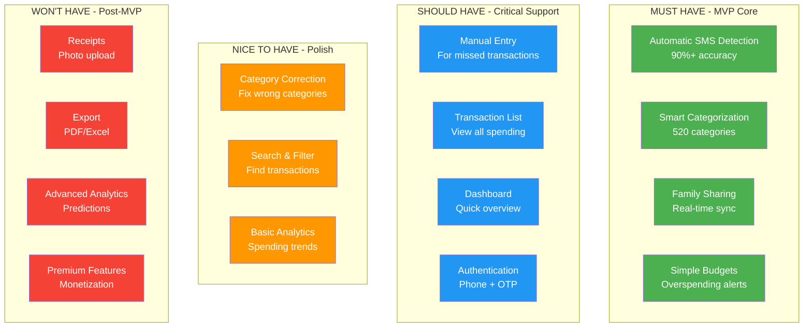
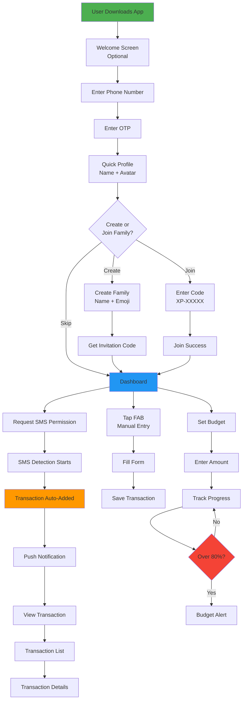
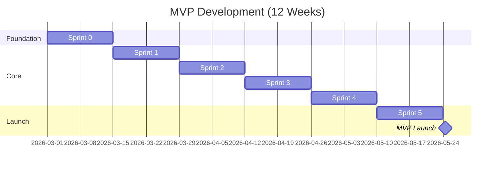

# XPENZ - MVP (MINIMUM VIABLE PRODUCT) DEFINITION

## 🎯 **MVP STRATEGY DOCUMENT**

---

## TABLE OF CONTENTS

1. [MVP Philosophy](https://claude.ai/chat/971e7306-581e-44ad-b38d-cd0919b5edd6#1-mvp-philosophy)
2. [Core Value Proposition](https://claude.ai/chat/971e7306-581e-44ad-b38d-cd0919b5edd6#2-core-value-proposition)
3. [MVP Feature Set](https://claude.ai/chat/971e7306-581e-44ad-b38d-cd0919b5edd6#3-mvp-feature-set)
4. [What's NOT in MVP](https://claude.ai/chat/971e7306-581e-44ad-b38d-cd0919b5edd6#4-whats-not-in-mvp)
5. [MVP User Journey](https://claude.ai/chat/971e7306-581e-44ad-b38d-cd0919b5edd6#5-mvp-user-journey)
6. [MVP Technical Scope](https://claude.ai/chat/971e7306-581e-44ad-b38d-cd0919b5edd6#6-mvp-technical-scope)
7. [MVP Timeline](https://claude.ai/chat/971e7306-581e-44ad-b38d-cd0919b5edd6#7-mvp-timeline)
8. [MVP Success Metrics](https://claude.ai/chat/971e7306-581e-44ad-b38d-cd0919b5edd6#8-mvp-success-metrics)
9. [MVP Launch Checklist](https://claude.ai/chat/971e7306-581e-44ad-b38d-cd0919b5edd6#9-mvp-launch-checklist)
10. [Post-MVP Roadmap](https://claude.ai/chat/971e7306-581e-44ad-b38d-cd0919b5edd6#10-post-mvp-roadmap)

---

## 1. MVP PHILOSOPHY

### 1.1 What is Our MVP?

```
MVP = Minimum VIABLE Product
     ↓
The smallest product that:
✅ Solves the core problem
✅ Delivers real value
✅ Users will actually pay for
✅ Can be built in 12 weeks
❌ NOT: Feature-complete
❌ NOT: Perfect & polished
❌ NOT: Everything we want
```

### 1.2 Core Problem We're Solving

```
PROBLEM:
"Indian families have no idea where their money goes each month"

ROOT CAUSES:
├── Too much manual work to track expenses
├── Multiple family members spending
├── No visibility into family spending
├── Can't control overspending
└── Existing apps don't work for Indian SMS/UPI

MVP SOLUTION:
"Automatically track ALL family expenses from SMS with 90%+ accuracy,
see real-time spending, and set simple budgets to avoid overspending"
```

### 1.3 MVP Success Definition

```yaml
SUCCESS = User says:
"This app AUTOMATICALLY tracks my family's spending
and helps us avoid overspending. I can't live without it!"

NOT SUCCESS = User says:
"Nice app, has lots of features"
"I'll check it out when I have time"
"It's okay, but I still track manually"
```

---

## 2. CORE VALUE PROPOSITION

### 2.1 The One Thing That Matters

```
┌─────────────────────────────────────────────────────────────┐
│                                                              │
│   "AUTOMATICALLY TRACK YOUR FAMILY'S EXPENSES FROM SMS"     │
│                                                              │
│   ↓ This is our ENTIRE MVP value proposition ↓             │
│                                                              │
│   Everything else is supporting infrastructure              │
│                                                              │
└─────────────────────────────────────────────────────────────┘
```

### 2.2 MVP Feature Priority Matrix



---

## 3. MVP FEATURE SET

### 3.1 MVP Features (Detailed)

```
┌─────────────────────────────────────────────────────────────┐
│ FEATURE 1: AUTOMATIC SMS DETECTION (MUST HAVE)              │
├─────────────────────────────────────────────────────────────┤
│ What:                                                        │
│ • Automatically detect transaction SMS from 20+ banks       │
│ • Parse amount, merchant, type (debit/credit)               │
│ • 90%+ parsing accuracy                                     │
│                                                              │
│ Why MVP:                                                     │
│ • THIS IS THE CORE VALUE PROPOSITION                        │
│ • Without this, we're just another expense tracker          │
│                                                              │
│ Scope:                                                       │
│ • 20 major banks (HDFC, ICICI, SBI, Axis, etc.)            │
│ • UPI apps (Paytm, GPay, PhonePe)                          │
│ • Credit card SMS                                            │
│ • Deduplication (no duplicate entries)                      │
│                                                              │
│ Out of Scope:                                                │
│ • Bank statement imports (post-MVP)                         │
│ • Email parsing (post-MVP)                                  │
│ • Non-Indian banks (post-MVP)                               │
└─────────────────────────────────────────────────────────────┘

┌─────────────────────────────────────────────────────────────┐
│ FEATURE 2: SMART CATEGORIZATION (MUST HAVE)                 │
├─────────────────────────────────────────────────────────────┤
│ What:                                                        │
│ • AI categorizes transactions (520 categories)              │
│ • 3-model ensemble (LSTM, CNN, Transformer)                │
│ • 86%+ accuracy (top-1), 96%+ (top-3)                      │
│ • Shows confidence score                                     │
│                                                              │
│ Why MVP:                                                     │
│ • Manual categorization = users abandon the app             │
│ • Smart categories = "wow" factor                           │
│                                                              │
│ Scope:                                                       │
│ • 520 categories (hierarchical)                             │
│ • On-device ML models (2.2 MB total)                        │
│ • Inference <200ms                                           │
│ • Top-3 predictions shown                                    │
│                                                              │
│ Out of Scope:                                                │
│ • Category customization (post-MVP)                         │
│ • Learning from corrections in real-time (post-MVP)         │
└─────────────────────────────────────────────────────────────┘

┌─────────────────────────────────────────────────────────────┐
│ FEATURE 3: FAMILY SHARING (MUST HAVE)                       │
├─────────────────────────────────────────────────────────────┤
│ What:                                                        │
│ • Create/join family with invitation code                   │
│ • See all family members' transactions                      │
│ • Real-time sync across devices                             │
│ • Up to 5 members (free tier)                               │
│                                                              │
│ Why MVP:                                                     │
│ • Family tracking is our differentiator                     │
│ • Competitors focus on individual tracking                  │
│                                                              │
│ Scope:                                                       │
│ • Create family                                             │
│ • Generate invitation code (XP-XXXXX)                       │
│ • Join via code                                             │
│ • View family dashboard                                      │
│ • Real-time transaction updates                             │
│                                                              │
│ Out of Scope:                                                │
│ • Multiple families (post-MVP)                              │
│ • Family chat (post-MVP)                                    │
│ • Transaction approval workflow (post-MVP)                  │
│                                                              │
│ ✅ Included (required for security rules):                   │
│ • Basic family roles (ADMIN/MEMBER) — ADMIN=creator,        │
│   MEMBER=joined. Required by Firestore security rules.      │
└─────────────────────────────────────────────────────────────┘

┌─────────────────────────────────────────────────────────────┐
│ FEATURE 4: SIMPLE BUDGETS (MUST HAVE)                       │
├─────────────────────────────────────────────────────────────┤
│ What:                                                        │
│ • Set monthly budget (one amount for all spending)          │
│ • Real-time progress tracking                               │
│ • Alerts at 80% and 100%                                    │
│ • Shows "days remaining" and "daily limit"                  │
│                                                              │
│ Why MVP:                                                     │
│ • Prevents overspending (core problem)                      │
│ • Simple = users actually use it                            │
│                                                              │
│ Scope:                                                       │
│ • ONE budget type: Total family spending                    │
│ • Monthly period only                                        │
│ • 2 alert thresholds (80%, 100%)                           │
│ • Push notifications                                         │
│                                                              │
│ Out of Scope:                                                │
│ • Category budgets (post-MVP)                               │
│ • Member budgets (post-MVP)                                 │
│ • Weekly/yearly budgets (post-MVP)                          │
│ • Custom alert thresholds (post-MVP)                        │
│ • Budget rollover (post-MVP)                                │
└─────────────────────────────────────────────────────────────┘

┌─────────────────────────────────────────────────────────────┐
│ FEATURE 5: MANUAL ENTRY (SHOULD HAVE)                       │
├─────────────────────────────────────────────────────────────┤
│ What:                                                        │
│ • Add transaction manually                                  │
│ • Simple form: Amount + Merchant + Category + Date         │
│ • Quick add via FAB                                         │
│                                                              │
│ Why MVP:                                                     │
│ • SMS detection won't catch 100% (cash, cards without SMS) │
│ • Users need backup option                                  │
│                                                              │
│ Scope:                                                       │
│ • Basic form (5 fields)                                     │
│ • Category picker (520 categories)                          │
│ • Date/time picker                                          │
│                                                              │
│ Out of Scope:                                                │
│ • Receipt photos (post-MVP)                                 │
│ • Location tagging (post-MVP)                               │
│ • Notes field (post-MVP)                                    │
│ • Tags (post-MVP)                                           │
└─────────────────────────────────────────────────────────────┘

┌─────────────────────────────────────────────────────────────┐
│ FEATURE 6: TRANSACTION LIST (SHOULD HAVE)                   │
├─────────────────────────────────────────────────────────────┤
│ What:                                                        │
│ • List all transactions (newest first)                      │
│ • Show: merchant, category, amount, date                    │
│ • Tap to view details                                        │
│ • Pull to refresh                                            │
│                                                              │
│ Why MVP:                                                     │
│ • Users need to verify auto-detected transactions          │
│ • Basic visibility into spending                            │
│                                                              │
│ Scope:                                                       │
│ • Infinite scroll                                           │
│ • Basic card design                                         │
│ • Transaction details screen                                │
│                                                              │
│ Out of Scope:                                                │
│ • Search (post-MVP)                                         │
│ • Filters (post-MVP)                                        │
│ • Sorting options (post-MVP)                                │
│ • Bulk operations (post-MVP)                                │
└─────────────────────────────────────────────────────────────┘

┌─────────────────────────────────────────────────────────────┐
│ FEATURE 7: DASHBOARD (SHOULD HAVE)                          │
├─────────────────────────────────────────────────────────────┤
│ What:                                                        │
│ • Total spent this month                                    │
│ • Budget progress bar                                        │
│ • Top 3 categories (pie chart)                              │
│ • Last 5 transactions                                        │
│                                                              │
│ Why MVP:                                                     │
│ • Quick overview at a glance                                │
│ • Landing screen after login                                │
│                                                              │
│ Scope:                                                       │
│ • 4 widgets (spending, budget, categories, recent)         │
│ • This month's data                                         │
│ • Pull to refresh                                            │
│                                                              │
│ Out of Scope:                                                │
│ • Date range selector (post-MVP)                            │
│ • Comparison with last month (post-MVP)                     │
│ • Insights/predictions (post-MVP)                           │
│ • Customizable widgets (post-MVP)                           │
└─────────────────────────────────────────────────────────────┘

┌─────────────────────────────────────────────────────────────┐
│ FEATURE 8: AUTHENTICATION (SHOULD HAVE)                     │
├─────────────────────────────────────────────────────────────┤
│ What:                                                        │
│ • Phone number + OTP login                                  │
│ • One-time profile setup (name, avatar)                    │
│ • Session management                                         │
│                                                              │
│ Why MVP:                                                     │
│ • Need user accounts for family sharing                     │
│ • Firebase makes this easy                                  │
│                                                              │
│ Scope:                                                       │
│ • Phone auth via Firebase                                   │
│ • Basic profile (name, phone, avatar)                       │
│ • Remember login                                             │
│                                                              │
│ Out of Scope:                                                │
│ • Email/password login (post-MVP)                           │
│ • Google/Facebook login (post-MVP)                          │
│ • Profile editing (post-MVP)                                │
│                                                              │
│ ✅ Moved to MVP (Google Play Store requirement since         │
│    Dec 2023 — apps MUST offer account deletion):            │
│ • Account deletion with data purge                          │
│   → Delete user document + all personal transactions        │
│   → Remove from families (reassign ADMIN if sole admin)     │
│   → Invalidate HKDF salt → encryption keys unrecoverable   │
│   → Firebase Auth account deletion                          │
│   → Confirmation dialog with 7-day grace period             │
└─────────────────────────────────────────────────────────────┘
```

### 3.2 MVP Feature Summary Table

| # | Feature | Priority | Effort | Value | MVP Status |
| --- | --- | --- | --- | --- | --- |
| 1 | SMS Detection | **MUST** | High | **Critical** | ✅ Included |
| 2 | ML Categorization | **MUST** | High | **Critical** | ✅ Included |
| 3 | Family Sharing | **MUST** | Medium | **Critical** | ✅ Included |
| 4 | Simple Budget | **MUST** | Low | **Critical** | ✅ Included |
| 5 | Manual Entry | **SHOULD** | Low | High | ✅ Included |
| 6 | Transaction List | **SHOULD** | Low | High | ✅ Included |
| 7 | Dashboard | **SHOULD** | Medium | High | ✅ Included |
| 8 | Authentication | **SHOULD** | Medium | High | ✅ Included |
| 9 | Account Deletion | **MUST** | Low | **Critical** | ✅ Included (Play Store mandate) |
| 10 | Category Correction | **COULD** | Low | Medium | ⚠️ Nice to Have |
| 11 | Basic Search | **COULD** | Low | Medium | ⚠️ Nice to Have |
| 12 | Onboarding | **COULD** | Medium | Medium | ⚠️ Nice to Have |

**Total MVP Features: 9 core + 3 optional = 12 features**

---

## 4. WHAT'S NOT IN MVP

### 4.1 Features Explicitly Cut

```
❌ CUT FROM MVP (Build After Launch):

PREMIUM FEATURES:
├── Subscription/monetization (Month 2)
├── Unlimited family members (Month 2)
├── Advanced analytics (Month 3)
├── Email reports (Month 3)
└── Export (PDF/Excel) (Month 2)

ADVANCED BUDGETS:
├── Category-specific budgets (Month 2)
├── Member-specific budgets (Month 2)
├── Weekly/yearly budgets (Month 3)
├── Budget rollover (Month 4)
└── Custom alert thresholds (Month 2)

UI POLISH:
├── Animations (keep minimal)
├── Themes (light mode only for MVP)
├── Customization (fixed UI)
├── Widgets (home screen)
└── Shortcuts

ADVANCED FEATURES:
├── Receipt photo scanning (Month 3)
├── OCR for receipts (Month 4)
├── Bill reminders (Month 3)
├── Groups & Splits — Splitwise-style bill splitting (Month 4-5; separate subsystem, Option B; see PRD F8 + PROJECT_COMPLETION_ROADMAP Phase 10)
├── Recurring transactions (Month 3)
├── Multi-currency (Month 5)
├── Bank integration (Month 6)
├── Web dashboard (Month 6)
└── AI insights (Month 4)

SOCIAL FEATURES:
├── Transaction comments (Month 3)
├── Family chat (Month 4)
├── Transaction approval (Month 5)
└── Shared notes (Month 3)

ANALYTICS:
├── Spending predictions (Month 4)
├── Comparison graphs (Month 2)
├── Trend analysis (Month 2)
├── Custom reports (Month 5)
└── Export data (Month 2)
```

### 4.2 Why These Are Cut

```
REASON 1: NOT CORE VALUE
├── Receipt scanning is nice, but SMS detection is the magic
├── Themes don't solve the core problem
└── Advanced analytics can wait until we have users

REASON 2: TIME TO MARKET
├── MVP target: 12 weeks
├── Full product: 20 weeks
└── Every week delay = lost users

REASON 3: LEARN FIRST
├── Don't know which features users actually want
├── Build, measure, learn
└── Let data drive feature decisions

REASON 4: TECHNICAL COMPLEXITY
├── Premium requires billing integration (complex)
├── Advanced budgets need more backend logic
└── Keep MVP technically simple
```

---

## 5. MVP USER JOURNEY

### 5.1 Complete MVP User Flow



### 5.2 Critical User Paths (Must Work Perfectly)

```
PATH 1: FIRST TIME USER (Most Important)
┌─────────────────────────────────────────────────────────────┐
│ 1. Download app from Play Store                             │
│ 2. Open app → See welcome screen (optional, can skip)      │
│ 3. Enter phone number                                       │
│ 4. Enter OTP (auto-detected if possible)                   │
│ 5. Enter name, pick avatar                                  │
│ 6. Create family (or skip)                                  │
│ 7. Grant SMS permission                                      │
│ 8. See dashboard (empty state)                              │
│ 9. Wait for first SMS transaction                           │
│ 10. Get notification: "Transaction detected!"               │
│ 11. Open app → See transaction in list                      │
│ 12. "WOW! It actually works!" 🎉                           │
│                                                             │
│ Success Metric: 75%+ complete this flow within 5 minutes   │
└─────────────────────────────────────────────────────────────┘

PATH 2: DAILY ACTIVE USER
┌─────────────────────────────────────────────────────────────┐
│ 1. Open app                                                  │
│ 2. See dashboard with:                                       │
│    - Total spent today/month                                │
│    - Budget progress                                         │
│    - Recent transactions                                     │
│ 3. Scroll transaction list                                  │
│ 4. Verify transactions are accurate                         │
│ 5. Add manual transaction if needed (cash spending)        │
│ 6. Check budget status                                       │
│ 7. Close app                                                 │
│                                                             │
│ Success Metric: <30 seconds to complete                     │
└─────────────────────────────────────────────────────────────┘

PATH 3: FAMILY MEMBER JOINS
┌─────────────────────────────────────────────────────────────┐
│ 1. Receive invitation code from family (via WhatsApp)      │
│ 2. Download app                                              │
│ 3. Sign up (phone + OTP + profile)                         │
│ 4. Enter invitation code: XP-A7K2M                          │
│ 5. See family name: "The Sharmas"                          │
│ 6. Tap "Join Family"                                        │
│ 7. Grant SMS permission                                      │
│ 8. See family dashboard with all family transactions       │
│ 9. See own transactions appear automatically                │
│                                                             │
│ Success Metric: 80%+ complete within 3 minutes              │
└─────────────────────────────────────────────────────────────┘
```

### 5.3 Edge Cases to Handle

```
EDGE CASE 1: SMS Permission Denied
├── Show: "App won't work without SMS permission"
├── Explain: "We need this to detect transactions"
├── Option: "Grant Permission" or "I'll add manually"
└── If denied: Still let them use app (manual mode)

EDGE CASE 2: No Transactions Detected (After 24 hours)
├── Show: "No transactions detected yet"
├── Check: "Have you received any bank SMS?"
├── Suggest: "Try adding a transaction manually"
└── Offer: "Contact support" button

EDGE CASE 3: Wrong Category
├── Show: Category with confidence score
├── Allow: Tap to change category
├── Save: User preference
└── Learn: (Post-MVP: improve ML model)

EDGE CASE 4: Duplicate Transaction
├── Detect: Same amount + merchant + time
├── Show: "Possible duplicate"
├── Allow: "Keep both" or "Delete duplicate"
└── Remember: User's choice

EDGE CASE 5: Family Code Expired
├── Show: "This invitation code has expired"
├── Suggest: "Ask family admin to generate new code"
└── Alternative: "Create your own family"
```

---

## 6. MVP TECHNICAL SCOPE

### 6.1 MVP Architecture (Simplified)

```
┌─────────────────────────────────────────────────────────────┐
│                      MVP ARCHITECTURE                         │
│                                                              │
│  ┌────────────────────────────────────────────────────┐    │
│  │            ANDROID APP (Kotlin)                     │    │
│  │  ┌──────────────────────────────────────────────┐  │    │
│  │  │  UI Layer (Jetpack Compose)                  │  │    │
│  │  │  - 5 screens only                             │  │    │
│  │  │  - Material 3 (minimal customization)        │  │    │
│  │  └──────────────────────────────────────────────┘  │    │
│  │  ┌──────────────────────────────────────────────┐  │    │
│  │  │  Business Logic                               │  │    │
│  │  │  - ViewModels (5)                            │  │    │
│  │  │  - Use Cases (10)                            │  │    │
│  │  └──────────────────────────────────────────────┘  │    │
│  │  ┌──────────────────────────────────────────────┐  │    │
│  │  │  Data Layer                                   │  │    │
│  │  │  - Room Database (6 tables, not 11)         │  │    │
│  │  │  - Repositories (4)                          │  │    │
│  │  └──────────────────────────────────────────────┘  │    │
│  │  ┌──────────────────────────────────────────────┐  │    │
│  │  │  Core Services                                │  │    │
│  │  │  - SMS Parser                                │  │    │
│  │  │  - ML Inference (3 models, 2.2MB)          │  │    │
│  │  │  - Sync Service                              │  │    │
│  │  └──────────────────────────────────────────────┘  │    │
│  └────────────────────────────────────────────────────┘    │
│                            ↕                                 │
│  ┌────────────────────────────────────────────────────┐    │
│  │            FIREBASE (Backend)                       │    │
│  │  - Firebase Auth (Phone)                           │    │
│  │  - Firestore (4 collections, not 7)              │    │
│  │  - Cloud Functions (3 functions, not 7)          │    │
│  │  - Cloud Storage (ML models only)                 │    │
│  │  - FCM (Push notifications)                        │    │
│  └────────────────────────────────────────────────────┘    │
└─────────────────────────────────────────────────────────────┘
```

### 6.2 MVP Database Schema (Simplified)

```
MVP DATABASE (6 Tables instead of 11):

1. users
   ├── user_id, phone_number, name, avatar_url
   ├── is_premium = false (always false in MVP)
   └── created_at, updated_at

2. families
   ├── family_id, name, emoji, invitation_code
   ├── created_by, max_members = 5
   └── created_at

3. family_members
   ├── member_id, family_id, user_id
   ├── nickname, role (ADMIN/MEMBER)
   └── joined_at

4. transactions
   ├── transaction_id, user_id, family_id
   ├── type, amount, merchant_name, category_id
   ├── ml_confidence, timestamp
   └── is_synced, created_at

5. budgets (SIMPLIFIED)
   ├── budget_id, family_id
   ├── amount, period = MONTHLY
   ├── start_date
   └── alert_thresholds = [80, 100]

6. ml_categories (READ-ONLY)
   ├── category_id (1-520)
   ├── category_name, emoji
   └── level

REMOVED FROM MVP:
❌ devices (not needed, use Firebase Auth tokens)
❌ subscriptions (no premium in MVP)
❌ budget_progress (calculate on-the-fly)
❌ notifications (use FCM, don't store)
❌ sync_queue (simpler sync in MVP)
```

### 6.3 MVP Firestore Collections (Simplified)

```
MVP FIRESTORE (4 Collections instead of 7):

1. /users/{userId}
   └── profile doc (basic info)

2. /families/{familyId}
   ├── info doc
   ├── members/ subcollection
   └── transactions/ subcollection

3. /invitations/{invitationCode}
   └── Simple lookup doc

4. /system
   └── config doc (app settings)

REMOVED FROM MVP:
❌ subscriptions (no premium)
❌ notifications (just use FCM)
❌ ml_corrections (no learning yet)
```

### 6.4 MVP Cloud Functions (Simplified)

```
MVP FUNCTIONS (3 instead of 7):

1. onTransactionCreate (Trigger)
   └── Calculate budget progress & send alerts

2. createFamily (Callable)
   └── Create family + generate code

3. joinFamily (Callable)
   └── Validate code + add member

REMOVED FROM MVP:
❌ verifyPurchase (no premium)
❌ exportData (no exports)
❌ scheduledBackup (manual backups)
❌ updateMLModels (manual updates)
```

---

## 7. MVP TIMELINE

> **📌 Timeline clarification:** The MVP is the first 12 weeks (Sprints 0–5)
> of the full 20-week Implementation Plan (see `06 - Implementation Plan (20-Week Roadmap).md`).
> Sprints 6–9 (weeks 13–20) cover post-MVP features, premium, and polish.

### 7.1 12-Week MVP Timeline



### 7.2 MVP Sprint Breakdown

```
┌─────────────────────────────────────────────────────────────┐
│ SPRINT 0: FOUNDATION (Week 1-2)                             │
├─────────────────────────────────────────────────────────────┤
│ Goals:                                                       │
│ ✅ Project setup complete                                   │
│ ✅ 6 database tables created                                │
│ ✅ Firebase configured                                       │
│ ✅ Navigation working                                        │
│                                                             │
│ Deliverables:                                                │
│ • Working app skeleton                                      │
│ • Database schema implemented                               │
│ • Basic UI framework                                         │
│ • CI/CD pipeline                                            │
└─────────────────────────────────────────────────────────────┘

┌─────────────────────────────────────────────────────────────┐
│ SPRINT 1: SMS DETECTION & ML (Week 3-4)                     │
├─────────────────────────────────────────────────────────────┤
│ Goals:                                                       │
│ ✅ SMS detection: 90%+ accuracy                             │
│ ✅ ML models working (86%+ accuracy)                        │
│ ✅ Auto-categorization functional                           │
│                                                             │
│ Deliverables:                                                │
│ • SMS receiver + parser (20 banks)                         │
│ • 3 ML models integrated (2.2MB)                           │
│ • End-to-end: SMS → Categorized Transaction                │
│ • Background processing                                      │
└─────────────────────────────────────────────────────────────┘

┌─────────────────────────────────────────────────────────────┐
│ SPRINT 2: TRANSACTIONS (Week 5-6)                           │
├─────────────────────────────────────────────────────────────┤
│ Goals:
```

Continuing MVP document...

---

```
┌─────────────────────────────────────────────────────────────┐
│ SPRINT 2: TRANSACTIONS (Week 5-6)                           │
├─────────────────────────────────────────────────────────────┤
│ Goals:                                                       │
│ ✅ Transaction list UI complete                             │
│ ✅ Manual entry working                                      │
│ ✅ Dashboard showing data                                    │
│                                                             │
│ Deliverables:                                                │
│ • Transaction list (infinite scroll)                        │
│ • Transaction detail screen                                 │
│ • Manual entry form                                          │
│ • Dashboard (4 widgets)                                      │
│ • Pull-to-refresh                                            │
└─────────────────────────────────────────────────────────────┘

┌─────────────────────────────────────────────────────────────┐
│ SPRINT 3: AUTH & FAMILY (Week 7-8)                          │
├─────────────────────────────────────────────────────────────┤
│ Goals:                                                       │
│ ✅ Phone auth working                                        │
│ ✅ Family create/join functional                            │
│ ✅ Real-time sync working                                    │
│                                                             │
│ Deliverables:                                                │
│ • Firebase Phone Auth                                        │
│ • Create family flow                                         │
│ • Join family flow                                           │
│ • Family dashboard                                           │
│ • Real-time transaction sync                                 │
└─────────────────────────────────────────────────────────────┘

┌─────────────────────────────────────────────────────────────┐
│ SPRINT 4: BUDGETS (Week 9-10)                               │
├─────────────────────────────────────────────────────────────┤
│ Goals:                                                       │
│ ✅ Simple budget working                                     │
│ ✅ Real-time progress tracking                              │
│ ✅ Alerts at 80% and 100%                                   │
│                                                             │
│ Deliverables:                                                │
│ • Set monthly budget                                         │
│ • Budget progress widget                                     │
│ • Alert notifications                                        │
│ • Budget detail screen                                       │
└─────────────────────────────────────────────────────────────┘

┌─────────────────────────────────────────────────────────────┐
│ SPRINT 5: POLISH & LAUNCH (Week 11-12)                      │
├─────────────────────────────────────────────────────────────┤
│ Goals:                                                       │
│ ✅ Zero P0 bugs                                              │
│ ✅ Performance optimized                                     │
│ ✅ 50 beta testers completed testing                        │
│ ✅ Play Store submission ready                              │
│                                                             │
│ Deliverables:                                                │
│ • All critical bugs fixed                                   │
│ • UI polished                                                │
│ • Beta testing complete                                      │
│ • Play Store listing                                         │
│ • Privacy policy + ToS                                       │
│ • MVP LAUNCHED! 🚀                                          │
└─────────────────────────────────────────────────────────────┘
```

### 7.3 Week-by-Week Milestones

| Week | Sprint | Key Milestone | Demo |
| --- | --- | --- | --- |
| 1-2 | 0 | Project setup complete | ✅ App runs, DB works |
| 3-4 | 1 | SMS → Transaction works | ✅ Auto-detect demo |
| 5-6 | 2 | Transaction UI complete | ✅ View/add transactions |
| 7-8 | 3 | Family sharing works | ✅ Multi-device sync |
| 9-10 | 4 | Budgets functional | ✅ Budget alerts |
| 11-12 | 5 | MVP ready to launch | ✅ Full app walkthrough |

---

## 8. MVP SUCCESS METRICS

### 8.1 Launch Criteria (Must Meet ALL)

```yaml
TECHNICAL QUALITY:
  ✅ Zero P0 bugs (critical/blocking)
  ✅ <5 P1 bugs (high priority)
  ✅ Crash rate: <2%
  ✅ ANR rate: <0.5%
  ✅ App size: <15 MB
  ✅ Cold start: <2 seconds
  ✅ ML inference: <200ms (p95)

FUNCTIONAL COMPLETENESS:
  ✅ SMS detection: 90%+ accuracy (tested with 100 SMS)
  ✅ ML categorization: 86%+ accuracy (tested with 10K samples)
  ✅ All 8 core features working
  ✅ Real-time sync: <5 seconds
  ✅ Budget alerts triggering correctly

USER EXPERIENCE:
  ✅ Onboarding completion: >70%
  ✅ First transaction within 24h: >75%
  ✅ Beta tester satisfaction: 4.0+ stars
  ✅ Beta testers willing to recommend: >80%

OPERATIONS:
  ✅ 50 beta testers completed testing
  ✅ All beta feedback reviewed
  ✅ Privacy policy published
  ✅ Terms of service published
  ✅ Support email active
  ✅ Play Store listing complete
```

### 8.2 Post-Launch Success Metrics

```yaml
WEEK 1 TARGETS:
  Users: 100
  Onboarding completion: >70%
  First transaction detected: >75%
  Crash rate: <2%
  Rating: 4.0+ stars

WEEK 4 TARGETS:
  Users: 500
  DAU: 200 (40% DAU/MAU)
  7-day retention: >40%
  Transactions tracked: 10,000+
  Families created: 100
  Rating: 4.2+ stars

WEEK 8 TARGETS:
  Users: 1,000
  DAU: 400 (40% DAU/MAU)
  30-day retention: >30%
  Transactions tracked: 50,000+
  Families created: 250
  Rating: 4.3+ stars
  Ready for Premium launch
```

### 8.3 Key Performance Indicators (KPIs)

```
PRIMARY KPI (Most Important):
━━━━━━━━━━━━━━━━━━━━━━━━━━━━━━━━━━━━━━━━━━━━━━━━━━━━━━━━━━
📊 "AUTOMATIC TRANSACTION DETECTION RATE"

= (Auto-detected transactions / Total transactions) × 100

Target: >85%

Why this matters:
• This IS our value proposition
• If <80%, users will abandon (too much manual work)
• High rate = sticky users = word-of-mouth growth
━━━━━━━━━━━━━━━━━━━━━━━━━━━━━━━━━━━━━━━━━━━━━━━━━━━━━━━━━━

SECONDARY KPIs:

1. Onboarding Completion Rate
   Formula: (Completed onboarding / Started) × 100
   Target: >70%
   Measure: Track drop-off at each step

2. First Transaction Time
   Formula: Time from signup to first auto-detected transaction
   Target: <24 hours
   Measure: Median time

3. 7-Day Retention
   Formula: (Users active on day 7 / Users signed up) × 100
   Target: >40%
   Measure: Cohort analysis

4. Daily Active Users (DAU)
   Formula: Unique users opening app per day
   Target: 40% of MAU
   Measure: Firebase Analytics

5. Budget Alert Effectiveness
   Formula: (Alerts acted upon / Total alerts) × 100
   Target: >60%
   Measure: Clicks on alert notification

6. Family Adoption
   Formula: (Users in families / Total users) × 100
   Target: >50%
   Measure: Family member count

7. ML Accuracy (User-Perceived)
   Formula: (Correct categories / Total transactions) × 100
   Target: >90% (higher than model accuracy due to corrections)
   Measure: User corrections vs auto-categorized
```

---

## 9. MVP LAUNCH CHECKLIST

### 9.1 Pre-Launch Checklist (Week 11-12)

```yaml
WEEK 11: FINAL DEVELOPMENT

Code Completion:
  - [ ] All 8 core features working
  - [ ] All P0 bugs fixed
  - [ ] All P1 bugs fixed or deferred
  - [ ] Code reviewed
  - [ ] Dead code removed
  - [ ] TODO comments removed

Testing:
  - [ ] Unit tests: 70%+ coverage
  - [ ] Integration tests pass
  - [ ] UI tests for critical flows pass
  - [ ] Manual testing on 5+ devices
  - [ ] Tested on Android 8.0 (API 26)
  - [ ] Tested on Android 14 (API 34)
  - [ ] Different screen sizes tested
  - [ ] Low-end device tested (2GB RAM)

Performance:
  - [ ] App launch: <2s (cold start)
  - [ ] ML inference: <200ms (p95)
  - [ ] 60 FPS maintained
  - [ ] No memory leaks
  - [ ] Battery drain: <3%/hour
  - [ ] App size: <15 MB

Security:
  - [ ] No hardcoded secrets
  - [ ] API keys in BuildConfig
  - [ ] ProGuard enabled
  - [ ] SSL pinning (if needed)
  - [ ] Data encryption working

WEEK 12: BETA TESTING

Beta Program:
  - [ ] 50 beta testers recruited
  - [ ] Beta testing guide sent
  - [ ] Feedback form created
  - [ ] Daily check-ins scheduled
  - [ ] Bug tracking setup

Monitoring:
  - [ ] Firebase Analytics configured
  - [ ] Crashlytics reporting working
  - [ ] Performance monitoring active
  - [ ] Custom events tracked

Documentation:
  - [ ] User guide written
  - [ ] FAQ created (10+ questions)
  - [ ] Privacy policy published
  - [ ] Terms of service published
  - [ ] Support email setup

Play Store:
  - [ ] App listing written
  - [ ] 8 screenshots created
  - [ ] Feature graphic designed
  - [ ] App icon finalized
  - [ ] Store listing preview checked

Legal:
  - [ ] Privacy policy reviewed
  - [ ] ToS reviewed
  - [ ] GDPR compliance checked
  - [ ] Data retention policy defined
```

### 9.2 Launch Day Checklist

```yaml
MORNING (9 AM):
  - [ ] Final build created (release variant)
  - [ ] Build signed with production keystore
  - [ ] Version code/name verified (1.0.0 / 10000)
  - [ ] ProGuard mapping file backed up
  - [ ] APK/AAB tested on device

  - [ ] Upload AAB to Play Console
  - [ ] Set release notes
  - [ ] Configure staged rollout: 5%
  - [ ] Set pricing: Free
  - [ ] Select content rating
  - [ ] Add privacy policy link
  - [ ] Submit for review

AFTERNOON (2 PM - If approved):
  - [ ] Publish to production (5% rollout)
  - [ ] Verify app is live on Play Store
  - [ ] Install from Play Store (test)
  - [ ] All features work in production

  - [ ] Send launch email to beta testers
  - [ ] Post on social media (Twitter, LinkedIn)
  - [ ] Update website with launch info
  - [ ] Monitor analytics dashboard

EVENING (6 PM):
  - [ ] Check crash rate (<2%)
  - [ ] Check ANR rate (<0.5%)
  - [ ] Review first user feedback
  - [ ] Respond to early reviews
  - [ ] Fix any critical issues immediately

CONTINUOUS (Next 48 hours):
  - [ ] Monitor every 2 hours
  - [ ] Respond to all reviews
  - [ ] Fix critical bugs in hotfix
  - [ ] Celebrate! 🎉
```

### 9.3 Rollout Schedule

```
STAGED ROLLOUT PLAN:

Day 1: 5% rollout
├── ~50 users (based on 1000 expected downloads)
├── Monitor closely every 2 hours
└── Halt if: Crash rate >2%, ANR >1%, Critical bug

Day 3: 10% rollout (if stable)
├── ~100 users
├── Monitor every 4 hours
└── Halt if: Same criteria

Day 7: 25% rollout
├── ~250 users
├── Monitor daily
└── Halt if: Rating <4.0, Crash rate >2%

Day 14: 50% rollout
├── ~500 users
├── Monitor daily
└── Continue if stable

Day 21: 100% rollout (FULL LAUNCH)
└── All users get the update

HALT CRITERIA (Rollback immediately):
❌ Crash rate >2%
❌ ANR rate >1%
❌ Rating drops below 3.8
❌ Critical data loss bug
❌ Payment issue (when premium launches)
```

---

## 10. POST-MVP ROADMAP

### 10.1 First 90 Days After MVP Launch

```
┌─────────────────────────────────────────────────────────────┐
│ MONTH 1: STABILIZATION & QUICK WINS                         │
├─────────────────────────────────────────────────────────────┤
│ Week 1-2: Bug Fixes & Stability                             │
│ ├── Fix all P0/P1 bugs reported                            │
│ ├── Respond to user reviews (100% response rate)           │
│ ├── Release v1.0.1 hotfix                                  │
│ └── Improve onboarding based on data                        │
│                                                             │
│ Week 3-4: Quick Feature Additions                           │
│ ├── Add basic search                                        │
│ ├── Add category correction UI                             │
│ ├── Add transaction notes                                   │
│ ├── Improve dashboard layout                                │
│ └── Release v1.1.0                                          │
│                                                             │
│ Goals:                                                       │
│ ├── 1,000 total users                                      │
│ ├── 4.2+ star rating                                        │
│ ├── 40%+ 7-day retention                                   │
│ └── <1% crash rate                                          │
└─────────────────────────────────────────────────────────────┘

┌─────────────────────────────────────────────────────────────┐
│ MONTH 2: MONETIZATION LAUNCH                                │
├─────────────────────────────────────────────────────────────┤
│ Week 5-6: Premium Development                               │
│ ├── Integrate Google Play Billing                          │
│ ├── Create pricing screen                                   │
│ ├── Implement 3 subscription plans                         │
│ ├── Add premium features:                                   │
│ │   ├── Unlimited family members                           │
│ │   ├── Advanced analytics                                 │
│ │   └── Export to PDF/Excel                                │
│ └── Test purchase flows                                     │
│                                                             │
│ Week 7-8: Premium Launch                                    │
│ ├── Launch premium subscriptions                           │
│ ├── Run promotion: 50% off first month                     │
│ ├── Add category-specific budgets                          │
│ ├── Add member-specific budgets                            │
│ └── Release v1.2.0                                          │
│                                                             │
│ Goals:                                                       │
│ ├── 5,000 total users                                      │
│ ├── 5% premium conversion                                  │
│ ├── ₹50,000 MRR (Monthly Recurring Revenue)               │
│ └── 50%+ 30-day retention                                  │
└─────────────────────────────────────────────────────────────┘

┌─────────────────────────────────────────────────────────────┐
│ MONTH 3: GROWTH FEATURES                                    │
├─────────────────────────────────────────────────────────────┤
│ Week 9-10: Social & Sharing                                 │
│ ├── Add referral program                                    │
│ ├── Improve invitation sharing                             │
│ ├── Add transaction comments                                │
│ ├── Email reports (Premium)                                │
│ └── Receipt photo upload                                    │
│                                                             │
│ Week 11-12: Analytics & Insights                            │
│ ├── Advanced spending analytics                            │
│ ├── Spending predictions                                    │
│ ├── Comparison graphs                                       │
│ ├── Bill reminders                                          │
│ └── Release v1.3.0                                          │
│                                                             │
│ Goals:                                                       │
│ ├── 10,000 total users                                     │
│ ├── 7% premium conversion                                  │
│ ├── ₹100,000 MRR                                           │
│ └── 30%+ 90-day retention                                  │
└─────────────────────────────────────────────────────────────┘
```

### 10.2 Feature Backlog (Priority Order)

```
IMMEDIATE (Month 1):
1. Basic search ⭐⭐⭐⭐⭐
2. Category correction UI ⭐⭐⭐⭐⭐
3. Transaction notes ⭐⭐⭐⭐
4. Filters (date, category) ⭐⭐⭐⭐

MONTH 2 (Premium Launch):
5. Google Play Billing ⭐⭐⭐⭐⭐
6. Category budgets ⭐⭐⭐⭐⭐
7. Member budgets ⭐⭐⭐⭐
8. Export (PDF/Excel) ⭐⭐⭐⭐
9. Unlimited family members ⭐⭐⭐⭐

MONTH 3 (Growth):
10. Referral program ⭐⭐⭐⭐⭐
11. Email reports ⭐⭐⭐⭐
12. Receipt photos ⭐⭐⭐⭐
13. Advanced analytics ⭐⭐⭐⭐
14. Bill reminders ⭐⭐⭐

MONTH 4-6 (Expansion):
15. Recurring transactions ⭐⭐⭐⭐
16. Groups & Splits (Splitwise-style) ⭐⭐⭐⭐ — separate subsystem (Option B); spec'd in PRD F8, Backend Schema §3.8, TRD Tables 12–17, PROJECT_COMPLETION_ROADMAP Phase 10
17. Receipt OCR ⭐⭐⭐
18. AI insights ⭐⭐⭐
19. Goals & savings ⭐⭐⭐
20. Multi-currency ⭐⭐⭐
21. Web dashboard ⭐⭐⭐
22. Bank integration ⭐⭐
```

### 10.3 When to Build What (Data-Driven)

```
DECISION FRAMEWORK:

Build Feature If:
✅ >30% of users request it (user surveys)
✅ Increases key metric (retention/conversion)
✅ Competitive necessity
✅ Can build in <1 week

Don't Build If:
❌ <10% want it (nice-to-have)
❌ Doesn't move key metrics
❌ High complexity / low value
❌ Can be solved with existing features

EXAMPLES:

"Should we add Receipt OCR?"
├── User requests: 15% (LOW)
├── Competitive necessity: Medium
├── Complexity: HIGH (1+ weeks)
├── Value: Medium
└── DECISION: Wait for Month 4

"Should we add Category Budgets?"
├── User requests: 45% (HIGH)
├── Competitive necessity: High
├── Complexity: LOW (3-4 days)
├── Value: HIGH (increases retention)
└── DECISION: Build in Month 2

"Should we add Dark Mode?"
├── User requests: 60% (VERY HIGH)
├── Competitive necessity: High
├── Complexity: LOW (2 days)
├── Value: HIGH (user satisfaction)
└── DECISION: Build in Month 1
```

---

## 11. MVP RISK MITIGATION

### 11.1 Top 5 MVP Risks

```
RISK 1: SMS Parsing Accuracy <90%
━━━━━━━━━━━━━━━━━━━━━━━━━━━━━━━━━━━━━━━━━━━━━━━━━━━━━━━━━━
Impact: CRITICAL - Core value proposition fails
Probability: MEDIUM

Mitigation:
├── Test with 200+ real SMS before launch
├── Add 30 bank patterns (not just 20)
├── Implement robust fallback parser
├── Allow easy manual correction
└── Show confidence scores to users

Contingency:
├── If <85%: Delay launch 1 week, fix patterns
├── If <80%: Re-architect parser completely
└── If <75%: Pivot to manual-first approach
━━━━━━━━━━━━━━━━━━━━━━━━━━━━━━━━━━━━━━━━━━━━━━━━━━━━━━━━━━

RISK 2: ML Model Accuracy <86%
━━━━━━━━━━━━━━━━━━━━━━━━━━━━━━━━━━━━━━━━━━━━━━━━━━━━━━━━━━
Impact: HIGH - Categorization fails
Probability: MEDIUM

Mitigation:
├── Train with 1M samples (not 500K)
├── Use better data augmentation
├── Improve rule-based fallback (>95% for known merchants)
├── Make category correction super easy
└── Learn from corrections quickly

Contingency:
├── If <83%: Launch anyway, improve post-MVP
├── If <80%: Enhance rule-based system
└── If <75%: Manual categorization as default
━━━━━━━━━━━━━━━━━━━━━━━━━━━━━━━━━━━━━━━━━━━━━━━━━━━━━━━━━━

RISK 3: Users Don't Grant SMS Permission
━━━━━━━━━━━━━━━━━━━━━━━━━━━━━━━━━━━━━━━━━━━━━━━━━━━━━━━━━━
Impact: HIGH - App can't work automatically
Probability: MEDIUM (30% of users might deny)

Mitigation:
├── Clear explanation before asking
├── Show video of how it works
├── "Your data never leaves your device" messaging
├── Optional: Skip and use manual mode
└── Re-prompt after they see value

Contingency:
├── Make manual entry REALLY fast
├── Add "Quick Add" widget
├── Support bank statement imports
└── Promote as "privacy-first" option
━━━━━━━━━━━━━━━━━━━━━━━━━━━━━━━━━━━━━━━━━━━━━━━━━━━━━━━━━━

RISK 4: Family Sharing Bugs (Data Loss)
━━━━━━━━━━━━━━━━━━━━━━━━━━━━━━━━━━━━━━━━━━━━━━━━━━━━━━━━━━
Impact: CRITICAL - Users lose trust
Probability: LOW

Mitigation:
├── Extensive multi-device testing (3+ devices)
├── Transaction versioning (detect conflicts)
├── Daily automatic backups
├── Comprehensive logging
└── Rollback capability

Contingency:
├── If data loss: Immediate rollback
├── Manual data recovery from backups
├── Compensate affected users (free premium)
└── Public apology + transparency
━━━━━━━━━━━━━━━━━━━━━━━━━━━━━━━━━━━━━━━━━━━━━━━━━━━━━━━━━━

RISK 5: Google Play Rejection
━━━━━━━━━━━━━━━━━━━━━━━━━━━━━━━━━━━━━━━━━━━━━━━━━━━━━━━━━━
Impact: HIGH - Launch delayed
Probability: LOW

Mitigation:
├── Follow all policy guidelines strictly
├── Clear privacy policy
├── Explain SMS permission usage clearly
├── Pre-submission policy review
└── Have alternate distribution ready

Contingency:
├── Address rejection issues within 24 hours
├── Re-submit immediately
├── Alternative: Soft launch via APK direct download
└── Build community while fixing issues
━━━━━━━━━━━━━━━━━━━━━━━━━━━━━━━━━━━━━━━━━━━━━━━━━━━━━━━━━━
```

---

## 12. MVP VS FULL PRODUCT COMPARISON

### 12.1 Feature Comparison Table

| Feature | MVP | Full Product |
| --- | --- | --- |
| **SMS Detection** | 20 banks | 50+ banks |
| **ML Accuracy** | 86%+ | 90%+ |
| **Categories** | 520 | 520 + custom |
| **Family Members** | 5 max | Unlimited (Premium) |
| **Budget Types** | 1 (Total only) | 3 (Family/Category/Member) |
| **Budget Periods** | Monthly only | Weekly/Monthly/Yearly |
| **Analytics** | Basic dashboard | Advanced insights + predictions |
| **Export** | None | PDF/Excel (Premium) |
| **Premium** | No monetization | 3 subscription tiers |
| **Receipts** | None | Photo + OCR |
| **Multi-device** | Yes (sync) | Yes + Web dashboard |
| **Customization** | None | Themes, categories, etc. |
| **Notifications** | Budget alerts | Smart alerts + insights |
| **Support** | Email only | Email + In-app chat |

### 12.2 Effort Comparison

```
MVP: 12 weeks (480 hours)
├── Core features only
├── Minimal polish
├── Limited testing
└── No monetization

Full Product: 20 weeks (800 hours)
├── All features
├── High polish
├── Comprehensive testing
└── Premium + advanced features

TIME SAVINGS: 8 weeks (40%)
RISK REDUCTION: Learn from real users before building everything
```

---

## 13. MVP SUCCESS STORIES (Validation)

### 13.1 Why MVP Approach Works

```
EXAMPLE 1: Instagram
━━━━━━━━━━━━━━━━━━━━━━━━━━━━━━━━━━━━━━━━━━━━━━━━━━━━━━━━━━
Original idea: Location-based check-in app (Burbn)

MVP: Photo sharing only
├── Just upload photo + filter
├── No stories
├── No reels
├── No DMs initially

Result: 25,000 users in 1 day
Learned: Users loved photos, not check-ins

Applied to Xpenz:
Our MVP = Just auto-tracking + simple budgets
Learn what users actually want, then build it
━━━━━━━━━━━━━━━━━━━━━━━━━━━━━━━━━━━━━━━━━━━━━━━━━━━━━━━━━━

EXAMPLE 2: Dropbox
━━━━━━━━━━━━━━━━━━━━━━━━━━━━━━━━━━━━━━━━━━━━━━━━━━━━━━━━━━
MVP: Simple video showing the concept

Result: 75,000 signups from Hacker News post
Learned: People want this, now build it

Applied to Xpenz:
Launch with core value prop
Validate demand before building advanced features
━━━━━━━━━━━━━━━━━━━━━━━━━━━━━━━━━━━━━━━━━━━━━━━━━━━━━━━━━━

EXAMPLE 3: Airbnb
━━━━━━━━━━━━━━━━━━━━━━━━━━━━━━━━━━━━━━━━━━━━━━━━━━━━━━━━━━
MVP: Just the founders' apartment
├── Simple website
├── Photos on digital camera
├── Manual process

Result: Proved concept, then scaled

Applied to Xpenz:
Start small (5 family members max)
Prove it works, then scale to unlimited
━━━━━━━━━━━━━━━━━━━━━━━━━━━━━━━━━━━━━━━━━━━━━━━━━━━━━━━━━━
```

---

## 14. MVP TEAM MOTIVATION

### 14.1 The MVP Mindset

```
❌ WRONG MINDSET:
"We need to build everything perfectly before launch"
"Users expect a polished, feature-complete product"
"Competitors have more features, we need to match them"
"What if users don't like it?"

✅ RIGHT MINDSET:
"Ship fast, learn fast, iterate fast"
"Users want their problem solved, not feature overload"
"First-mover advantage > feature parity"
"Users will tell us what they want - let's listen"

THE MVP MANTRA:
━━━━━━━━━━━━━━━━━━━━━━━━━━━━━━━━━━━━━━━━━━━━━━━━━━━━━━━━━━
"Build the MINIMUM product that delivers MAXIMUM value"

NOT:
"Build the MAXIMUM product that delivers MINIMUM value"
━━━━━━━━━━━━━━━━━━━━━━━━━━━━━━━━━━━━━━━━━━━━━━━━━━━━━━━━━━
```

### 14.2 Decision Framework

```
When tempted to add a feature to MVP, ask:

1. "Does this solve the CORE problem?"
   If NO → Cut it

2. "Can we launch without this?"
   If YES → Cut it

3. "Will users abandon if this is missing?"
   If NO → Cut it

4. "Can we add this post-launch?"
   If YES → Cut it

5. "Will this take more than 1 week?"
   If YES → Seriously consider cutting it
```

---

## 15. MVP LAUNCH ANNOUNCEMENT

### 15.1 Launch Message Template

```
Subject: 🎉 Xpenz MVP is LIVE! Your Family's Expense Tracker

Hi [Name],

After 12 weeks of development, I'm excited to announce that
Xpenz MVP is now live on Google Play Store! 🚀

What is Xpenz?
━━━━━━━━━━━━━━━━━━━━━━━━━━━━━━━━━━━━━━━━━━━━━━━━━━━━━━━━━━
The ONLY Indian expense tracker that:
✅ Automatically detects 90%+ of your transactions from SMS
✅ Categorizes them using AI (86%+ accuracy)
✅ Tracks your entire family's spending in real-time
✅ Alerts you before you overspend

Download: [Play Store Link]

Why I Built This:
━━━━━━━━━━━━━━━━━━━━━━━━━━━━━━━━━━━━━━━━━━━━━━━━━━━━━━━━━━
I was tired of manually tracking every single expense.
I tried 10+ apps - none worked for Indian banks/UPI.
So I built Xpenz to solve this problem for Indian families.

What's in MVP:
━━━━━━━━━━━━━━━━━━━━━━━━━━━━━━━━━━━━━━━━━━━━━━━━━━━━━━━━━━
✅ Automatic SMS detection (20+ banks)
✅ AI categorization (520 categories)
✅ Family sharing (up to 5 members)
✅ Simple monthly budgets
✅ Real-time sync across devices

What's Coming Next:
━━━━━━━━━━━━━━━━━━━━━━━━━━━━━━━━━━━━━━━━━━━━━━━━━━━━━━━━━━
🔜 Premium subscriptions (Month 2)
🔜 Advanced budgets (Month 2)
🔜 Receipt scanning (Month 3)
🔜 Advanced analytics (Month 3)
🔜 And much more based on YOUR feedback!

Help Me Improve:
━━━━━━━━━━━━━━━━━━━━━━━━━━━━━━━━━━━━━━━━━━━━━━━━━━━━━━━━━━
This is MVP - it's not perfect, but it WORKS.
I need your honest feedback to make it better.

📧 Email me: feedback@xpenz.app
⭐ Rate on Play Store (please be kind!)
🐛 Report bugs via in-app feedback

Thank you for being an early user! 🙏

Best regards,
[Your Name]
Founder, Xpenz

P.S. Invite your family - it's way more useful when everyone's on it!
```

---

## 📊 MVP SUMMARY

### Final MVP Checklist

```yaml
✅ WHAT WE'RE BUILDING:
  - Automatic expense tracking from SMS (90%+ accuracy)
  - AI categorization (86%+ accuracy, 520 categories)
  - Family sharing (5 members, real-time sync)
  - Simple monthly budgets (alerts at 80% and 100%)
  - Manual transaction entry
  - Transaction list with pull-to-refresh
  - Basic dashboard (4 widgets)
  - Phone authentication

✅ WHAT WE'RE NOT BUILDING (Yet):
  - Premium subscriptions → Month 2
  - Advanced budgets → Month 2
  - Receipt scanning → Month 3
  - Analytics & insights → Month 3
  - Export features → Month 2
  - Themes & customization → Month 3

✅ MVP TIMELINE:
  - Total: 12 weeks (3 months)
  - Sprint 0: Setup (2 weeks)
  - Sprint 1: SMS + ML (2 weeks)
  - Sprint 2: Transactions (2 weeks)
  - Sprint 3: Auth + Family (2 weeks)
  - Sprint 4: Budgets (2 weeks)
  - Sprint 5: Polish + Launch (2 weeks)

✅ SUCCESS CRITERIA:
  - SMS detection: 90%+ accuracy
  - ML categorization: 86%+ accuracy
  - Crash rate: <2%
  - Onboarding completion: >70%
  - Beta tester satisfaction: 4.0+ stars
  - 50 beta testers completed testing

✅ LAUNCH TARGETS (Week 1):
  - 100 users
  - 4.0+ star rating
  - 70%+ onboarding completion
  - 75%+ first transaction within 24h
```

---

## 🚀 **MVP LAUNCH = MILESTONE 1**

**The journey from idea to MVP is complete!**

**Next Steps:**

1. ✅ Complete MVP Document (DONE)
2. 📋 Start Sprint 0: Project Setup
3. 💻 Begin 12-week development
4. 🎉 Launch MVP in Week 12
5. 📈 Iterate based on user feedback

---

**Remember: MVP is not about building less. It's about learning more with less.**

**Ship it, learn from it, improve it. That's how great products are built!** 🚀

---

Would you like me to create:

1. **Detailed Sprint 0 task list** (day-by-day breakdown)?
2. **MVP demo script** (for showing to beta testers)?
3. **User interview guide** (for gathering feedback)?

You're right! Let me create a much more detailed PRD with all the specifications. I'll make it comprehensive and AI-ready.

---

